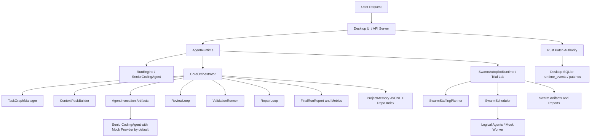
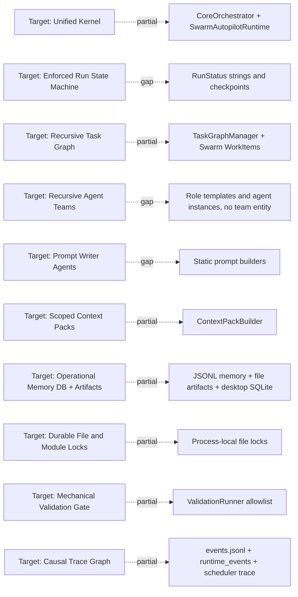

# Recursive Agentic Factory Alignment Audit

## 0. Audit Metadata

- Repository: `D:\projects\Ai\Hivo_Studio_(Multi-Agent-Coding-System)`
- Audit date: 2026-05-24
- Audit mode: read-only surprise architecture audit
- Git repository: Yes
- Allowed write used: this report file only, `AUDIT_RECURSIVE_AGENTIC_FACTORY_ALIGNMENT.md`
- Tests/builds run: No. The prompt prohibited fixers/generators and this audit avoided commands likely to write artifacts. Existing tests were inspected as evidence but not executed.
- Initial repository status: dirty before audit, with pre-existing modified source/config/doc files and many untracked `.agent_memory`, runtime, docs, tests, and temp artifacts.
- Primary read-only inspection commands used:
  - `git status --short`
  - `Get-Location`
  - `Get-ChildItem -Force`
  - `rg --files`
  - `rg -n "orchestrator|agent|task|workflow|state|memory|prompt|context|review|validation|integrat|campaign|trace|artifact|lock|scheduler|queue|planner|swarm|recursive|team|worker|sqlite|postgres|vector|embedding|schema" .`
  - Targeted `Get-Content`, `Select-Object`, and `rg -n` inspections of runtime, orchestration, memory, protocol, tests, docs, and desktop database files.

## 1. Executive Summary

This repository is meaningfully aligned with the target direction, but it is not yet a fully recursive, memory-backed, prompt-generating, self-staffing software factory.

The strongest evidence is in the Phase 4/Phase 5 orchestration code:

- `apps/agent-runtime/src/orchestration/Orchestrator.ts` defines `CoreOrchestrator`, a central runtime that owns run creation, deterministic task graph creation, context packs, agent invocation artifacts, review, validation, repair task creation, metrics, reports, and memory appends.
- `apps/agent-runtime/src/orchestration/TaskGraphManager.ts` enforces task state transitions and dependency readiness.
- `apps/agent-runtime/src/orchestration/ArtifactStore.ts` persists run artifacts under `.agent_memory/runs/<run_id>/`.
- `apps/agent-runtime/src/orchestration/ContextPackBuilder.ts` builds bounded context packs from repo memory and file summaries.
- `apps/agent-runtime/src/orchestration/ValidationRunner.ts`, `ReviewLoop.ts`, `RepairLoop.ts`, `PatchSafety.ts`, `ApprovalGates.ts`, and `FileLockManager.ts` implement important gate and safety primitives.
- `apps/agent-runtime/src/swarm/SwarmRuntime.ts`, `SwarmScheduler.ts`, and `SwarmStaffingPlanner.ts` implement a self-staffing swarm planning and mock scheduling layer with dynamic specialists, executor caps, work items, dependencies, scheduler traces, and trial artifacts.
- `apps/desktop/src-tauri/src/db/mod.rs` and `apps/desktop/src-tauri/src/commands/patch.rs` provide real local SQLite persistence and Rust-owned patch application authority for the desktop runtime path.

The main limitation is that several advanced factory concepts exist as scaffolding, heuristics, docs, or mock-worker flows rather than production runtime behavior. The repository has strong primitives, but they are split across multiple runtime paths and are not yet unified into one enforced kernel with durable run state, durable locks, full trace causality, prompt writer agents, recursive teams, provider-backed swarm workers, or a factory-grade database schema.

## 2. Final Verdict

Overall Alignment Score: 60 / 100

Infrastructure Readiness: 68 / 100

Actual Recursive Factory Behavior: 38 / 100

Safety and Validation Maturity: 64 / 100

Memory and Retrieval Maturity: 58 / 100

Prompt Generation Maturity: 42 / 100

Verdict: The repository is a credible early internal-swarm factory platform, not just a single agent. It appears closest to a hybrid of target stages `0.2 One Writer Loop`, `0.3 Few Writers + Locks`, and `0.4 Prompt Writer Agents` preparation, with Phase 5/6-style mock swarm and trial infrastructure. It is not yet a real recursive factory because recursive team entities, prompt writer agents, provider-backed logical workers, durable orchestration DB records, strict run state transitions, and trace-linked learning loops are incomplete or missing.

## 3. Scorecard

| Category | Weight | Score / 5 | Weighted Score | Status | Notes |
|---|---:|---:|---:|---|---|
| 1. Agentic Kernel, State Machine, and Run Lifecycle | 12% | 3.0 | 7.2 | Partial | `CoreOrchestrator` and `SwarmAutopilotRuntime` exist, but run transitions are not policy-enforced and kernels are split. |
| 2. Task Graph, Scheduler, and Work Queue | 8% | 3.5 | 5.6 | Partial | Task graph and swarm scheduler are useful; core path is mostly sequential and not DB-backed. |
| 3. Intake, Prompt Rewrite, Clarification, Complexity, and Planning | 10% | 2.5 | 5.0 | Partial | Project intake and staffing complexity exist; prompt rewrite and plan multiplication are absent. |
| 4. Recursive Teams, Dynamic Staffing, and Domain Orchestrators | 10% | 3.0 | 6.0 | Partial | Dynamic staffing is strong; recursive teams and domain sub-orchestrators are missing. |
| 5. Prompt System, Prompt Writer Agents, and Context Packs | 12% | 2.5 | 6.0 | Partial | Context packs are useful; prompt system and prompt writers are weak or missing. |
| 6. Memory, Artifact Store, Retrieval, and Lessons | 14% | 3.0 | 8.4 | Partial | File-backed memory/index/artifacts are real; no factory DB, FTS/vector retrieval, or strong memory schema. |
| 7. Execution Safety, Patch Model, Locks, and Scope Control | 10% | 3.5 | 7.0 | Partial | Good patch and approval primitives; locks are process-local and semantic locks are absent. |
| 8. Review, Validation, Integration, and Repair Loops | 12% | 3.0 | 7.2 | Partial | Review, validation, repair exist; integration is weak and blocked validation can be too lenient. |
| 9. Observability, Traceability, Reporting, and Debugging | 7% | 3.5 | 4.9 | Partial | Events, traces, reports, and runtime events exist; causal trace graph is incomplete. |
| 10. Policy Engine, Campaign Mode, Learning Loop, and Roadmap Readiness | 5% | 3.0 | 3.0 | Partial | Policy/campaign/learning primitives exist; no unified policy engine or confidence-backed learning loop. |
| Total | 100% | 3.02 avg | 60.3 | Partial | Rounded overall score: 60 / 100. |

| Capability | Status | Score | Evidence | Main Gap | Priority |
|---|---|---:|---|---|---|
| Central orchestration runtime | Partial | 3 | `CoreOrchestrator`, `SwarmAutopilotRuntime` | Split runtime paths and mock execution | High |
| Run lifecycle | Partial | 3 | `RunStatus` in `OrchestrationModels.ts` | No enforced transition matrix | High |
| Task graph | Implemented | 4 | `TaskGraphManager.ts` | Target lifecycle states incomplete | High |
| Scheduler | Partial | 3 | `SwarmScheduler.ts` | Core path mostly sequential, no cost/rate model | Medium |
| Raw request storage | Partial | 3 | `Run.user_request`, `SwarmRun.user_goal`, `AgentRuntimeSession.userPrompt` | No canonical raw request artifact | Medium |
| Prompt rewrite | Not Found | 0 | No dedicated rewriter found | Missing structured pre-planning rewrite | High |
| Clarification strategy | Partial | 3 | `ProjectIntake.ts`, `AgentRuntime.buildPlanClarification` | Not a full blocking-question policy | Medium |
| Dynamic staffing | Implemented | 4 | `SwarmStaffingPlanner.ts` | Uses mock workers by default | High |
| Recursive teams | Not Found | 1 | No `agent_teams` runtime entity | Missing parent-child team scopes | High |
| Context packs | Implemented | 4 | `ContextPackBuilder.ts` | Missing explicit inclusion reasons | High |
| Prompt writer agents | Not Found | 0 | No `PromptWriter` runtime role found | Missing prompt-generation layer | High |
| Artifact store | Implemented | 4 | `ArtifactStore.ts`, `SwarmArtifactStore.ts` | No DB metadata refs | High |
| Memory schema | Partial | 2 | `memory/types.ts`, `ProjectMemory.ts` | Lacks confidence/freshness/source refs | High |
| Repo index | Implemented | 4 | `RepoIndexer.ts` | Ranking and risk scoring are heuristic | Medium |
| Patch safety | Partial | 3 | `PatchSafety.ts`, Rust `patch.rs` | Core executor patch refs are weak | High |
| File locks | Partial | 3 | `FileLockManager.ts` | Not durable/distributed | High |
| Semantic locks | Not Found | 0 | No module lock equivalent found | Missing API/module conflict control | Medium |
| Review gate | Partial | 3 | `ReviewLoop.ts` | Heuristic, not real independent reviewers | High |
| Validation runner | Partial | 3 | `ValidationRunner.ts` | Blocked/skipped semantics too permissive | High |
| Integration manager | Stub | 2 | `createIntegrationResult`, `MergeController.ts` | No robust accepted-patch integration phase | High |
| Trace events | Partial | 3 | `events.jsonl`, `runtime_events`, scheduler trace | No unified causal trace graph | High |
| Campaign mode | Partial | 3 | `CampaignManager.ts`, campaign scripts/tests | Not deeply tied to recursive teams | Medium |
| Learning loop | Partial | 2 | `compactMemory`, swarm trial memory | Weak evidence/confidence policy | Medium |

## 4. Current Repository Map

Major top-level areas:

- `apps/agent-runtime/src/runtime/`: interactive session runtime, session snapshots, durable runtime event reads, simple and orchestrated turn execution.
- `apps/agent-runtime/src/orchestration/`: Phase 4 factory primitives: core orchestrator, task graph manager, artifacts, context packs, validation, review, repair, locks, patch safety, approvals, metrics, campaigns.
- `apps/agent-runtime/src/swarm/`: Phase 5/6 internal swarm autopilot and trial lab: staffing, scheduler, work items, role templates, mock workers, specialists, artifacts, metrics, comparison trials.
- `apps/agent-runtime/src/memory/`: repo indexing, memory layout, command inventory, project intelligence, freshness, memory compaction.
- `apps/agent-runtime/src/scheduler/`: older orchestrated runtime task graph, scheduler, locks, merge controller.
- `apps/agent-runtime/src/agents/`: deterministic/heuristic agents for product, business, engineering, security, review, generic worker behavior.
- `packages/protocol/src/`: shared TypeScript protocol types for runtime sessions, approvals, orchestration, task graphs, events, models.
- `apps/desktop/src-tauri/src/`: Rust desktop backend, SQLite schema, patch application authority, command/system/file/project commands.
- `docs/`: architecture docs, contracts, setup, status, internal swarm plan, trial lab plan.
- `.agent_memory/`: local memory, generated run/trial artifacts, index and swarm memory files.

Entrypoints found:

- CLI scripts in `package.json`:
  - `agent:run`, `agent:plan`, `agent:inspect-run`, `agent:report`, `agent:resume`
  - `agentic:run`, `agentic:plan`, `agentic:inspect`, `agentic:report`, `agentic:resume`
  - `campaign:create`, `campaign:plan`, `campaign:run-next`, `campaign:pause`, `campaign:resume`, `campaign:report`, `campaign:metrics`
  - `agent:trial:*` and `agent trial ...` command family
  - `memory:*` index, inspect, status, compact, and command inventory scripts
- API server entrypoint: `apps/agent-runtime/src/server.ts`
- Main interactive runtime: `apps/agent-runtime/src/runtime/AgentRuntime.ts`
- Phase 4 orchestrator: `apps/agent-runtime/src/orchestration/Orchestrator.ts`
- Phase 5 swarm runtime: `apps/agent-runtime/src/swarm/SwarmRuntime.ts`
- Desktop persistence and patch authority: `apps/desktop/src-tauri/src/db/mod.rs`, `apps/desktop/src-tauri/src/commands/patch.rs`

Existing Components Map:

| Component Found | Path | Purpose | Target Component Equivalent | Confidence |
|---|---|---|---|---:|
| `CoreOrchestrator` | `apps/agent-runtime/src/orchestration/Orchestrator.ts` | Central Phase 4 run orchestration | Agentic Kernel / RunManager | 0.90 |
| `SwarmAutopilotRuntime` | `apps/agent-runtime/src/swarm/SwarmRuntime.ts` | Self-staffing mock swarm runtime | Dynamic Staffing / Internal Swarm OS | 0.90 |
| `TaskGraphManager` | `apps/agent-runtime/src/orchestration/TaskGraphManager.ts` | Persistent task graph with transition checks | TaskGraphManager / Task State Machine | 0.95 |
| `SwarmScheduler` | `apps/agent-runtime/src/swarm/SwarmScheduler.ts` | Dependency and role-limited work scheduling | WorkerScheduler / Work Queue | 0.85 |
| `ArtifactStore` | `apps/agent-runtime/src/orchestration/ArtifactStore.ts` | Run artifacts and events under `.agent_memory/runs` | ArtifactStore / Trace Store | 0.95 |
| `SwarmArtifactStore` | `apps/agent-runtime/src/swarm/SwarmArtifactStore.ts` | Swarm run artifacts, scheduler trace, reports | Swarm ArtifactStore | 0.90 |
| `ContextPackBuilder` | `apps/agent-runtime/src/orchestration/ContextPackBuilder.ts` | Bounded context packs from repo memory | ContextPackBuilder | 0.90 |
| `ProjectMemory` | `apps/agent-runtime/src/memory/ProjectMemory.ts` | File-backed memory append/read/compact APIs | MemoryStore | 0.80 |
| `RepoIndexer` | `apps/agent-runtime/src/memory/RepoIndexer.ts` | Hash, summaries, commands, symbols, intelligence | FileIndex / Retrieval Base | 0.90 |
| `ValidationRunner` | `apps/agent-runtime/src/orchestration/ValidationRunner.ts` | Safe allowlisted validation command runner | ValidationRunner | 0.80 |
| `ReviewLoop` | `apps/agent-runtime/src/orchestration/ReviewLoop.ts` | Heuristic review decisions | ReviewGate | 0.75 |
| `RepairLoop` | `apps/agent-runtime/src/orchestration/RepairLoop.ts` | Bounded repair task creation | RepairLoop | 0.75 |
| `OrchestrationFileLockManager` | `apps/agent-runtime/src/orchestration/FileLockManager.ts` | In-memory path locks | LockManager | 0.75 |
| `ApprovalGates` | `apps/agent-runtime/src/orchestration/ApprovalGates.ts` | Risky file/delete/public API approval checks | PolicyEngine subset | 0.75 |
| Desktop SQLite schema | `apps/desktop/src-tauri/src/db/mod.rs` | Sessions, tasks, patches, runtime events | Persistence substrate | 0.85 |
| Rust patch command | `apps/desktop/src-tauri/src/commands/patch.rs` | Authoritative patch application and reconciliation | Patch Authority / Integration subset | 0.85 |
| `CampaignManager` | `apps/agent-runtime/src/orchestration/CampaignManager.ts` | Campaign lifecycle commands | Campaign Mode | 0.75 |

Current architecture diagram:



## 5. Current Architecture As Implemented

- What starts a run?
  - Interactive runs start through `AgentRuntime` in `apps/agent-runtime/src/runtime/AgentRuntime.ts` and the Fastify API in `apps/agent-runtime/src/server.ts`.
  - Factory-style runs start through `CoreOrchestrator.planOnly()` or `CoreOrchestrator.runAgenticTask()` in `apps/agent-runtime/src/orchestration/Orchestrator.ts`.
  - Swarm runs start through `SwarmAutopilotRuntime.plan()` or `SwarmAutopilotRuntime.run()` in `apps/agent-runtime/src/swarm/SwarmRuntime.ts`.

- What creates tasks?
  - `CoreOrchestrator.createTaskGraph()` creates Scout, Planner, Executor, and Reporter tasks, with optional split executor tasks based on request text.
  - `TaskGraphManager.createTask()` persists tasks and dependencies.
  - `createInitialSwarmWorkItems()` in `apps/agent-runtime/src/swarm/SwarmFanInOut.ts` creates scout, planner, architect, executor, reviewer, specialist, tester, integrator, memory, and reporter work items from staffing plans.

- What runs agents?
  - `CoreOrchestrator.invokeRole()` builds a context pack and prompt, then either returns deterministic role outputs or calls `SeniorCodingAgent` via `SessionManager`.
  - Swarm execution uses `SwarmScheduler` and a `SwarmWorker`; the default worker is mock/deterministic, not a real model worker.
  - Older orchestrated runtime uses `OrchestratedRuntime`, `EngineeringOrchestrator`, and deterministic `GenericWorkerAgent` style workers.

- How prompts are built?
  - `CoreOrchestrator.buildRolePrompt()` builds role prompts as static string templates with task, objective, allowed files, forbidden files, relevant files, validation requirements, and structured-output instructions.
  - Additional prompt text files exist under `apps/agent-runtime/src/prompts/`.
  - No dedicated prompt writer agent or versioned prompt artifact system was found.

- Where memory is stored?
  - File-backed memory lives under `.agent_memory/`.
  - `ProjectMemory.ts` manages JSONL files for decisions, task history, lessons, failed attempts, successful patterns, and project glossary/architecture notes.
  - `RepoIndexer.ts` writes repo index, file manifest, symbol index, file summaries, command inventory, project intelligence, and index state.
  - Desktop runtime has SQLite tables such as `project_memory`, `runtime_events`, `patches`, and `tasks`, but that DB is not yet the factory orchestration database.

- How outputs are saved?
  - `ArtifactStore.ts` writes context packs, invocations, raw outputs, parsed outputs, reports, patches, reviews, validation logs, integration records, repairs, locks, checkpoints, metrics, and events under `.agent_memory/runs/<run_id>/`.
  - `SwarmArtifactStore.ts` writes swarm run artifacts under `.agent_memory/swarm_runs/<run_id>/`.
  - Desktop runtime events and patch records are written to SQLite by the Rust backend.

- How validation works?
  - `ValidationRunner.ts` chooses safe commands, prepends `git diff --check` when possible, filters by allowlist, runs commands with timeouts, and stores logs.
  - Validation is safer than unbounded shell execution, but the default allowlist is narrow and blocked validation can be treated as passed if at least one safe command ran.

- How reports are produced?
  - `CoreOrchestrator.createFinalReport()` creates `FinalRunReport` from run/tasks/validation/artifacts.
  - `SwarmAutopilotRuntime` writes swarm final reports and metrics.
  - Campaign and trial lab components write additional reports and metrics.

## 6. Target Architecture Baseline

Target baseline:

```text
Kernel -> State Machine -> Task Graph -> Context Packs -> Agent Calls -> Structured Outputs -> Gates -> Memory
```

The target system should store raw requests, rewrite prompts into structured specs, ask only blocking clarifications, estimate complexity/risk, create and merge multiple plans, recursively decompose tasks, dynamically staff teams, build scoped context packs, generate prompts with prompt writer agents, run scoped executors, gate patches with review and validation, integrate accepted work, update memory, and report from traces.

Target vs current gap map:



## 7. High-Level Gap Summary

- The repo has strong architecture primitives, but the main runtime path is still split between interactive `AgentRuntime`, Phase 4 `CoreOrchestrator`, Phase 5 `SwarmAutopilotRuntime`, older `OrchestratedRuntime`, and Rust patch authority.
- Dynamic staffing exists and is tested, but real provider-backed swarm workers are not the default.
- Context packs exist, but prompt writer agents and prompt quality gates do not.
- Memory exists, but it is mostly file-backed JSON/JSONL without the target confidence/freshness/source/content-ref schema.
- Artifacts exist, but a factory database schema tying runs, tasks, prompts, outputs, reviews, validations, memory chunks, locks, metrics, and trace events together is missing.
- Task state is enforced in the Phase 4 task graph, but run state transitions are not guarded by a state machine.
- Safety is real in several places, especially scope checks, approvals, and Rust patch application, but locks are process-local and semantic/module locks are absent.
- Validation is present and persisted, but skipped/blocked validation semantics are not strict enough for production factory claims.
- Reporting exists, but final reports are not fully generated from a unified trace causality graph.

## 8. Detailed Checklist Audit

### 8.1 Agentic Kernel, State Machine, and Run Lifecycle

#### 1.1 Deterministic Agentic Kernel

- Target expectation: A central kernel owns lifecycle, task graph, scheduling, context packs, prompts, locks, artifacts, validation, review, memory, and reporting.
- What I searched for: `kernel`, `runtime`, `engine`, `orchestrator`, `coordinator`, `controller`, `manager`.
- Evidence found: `CoreOrchestrator` in `apps/agent-runtime/src/orchestration/Orchestrator.ts` owns most Phase 4 runtime steps. `SwarmAutopilotRuntime` in `apps/agent-runtime/src/swarm/SwarmRuntime.ts` owns swarm planning/scheduling/reporting. `AgentRuntime.ts` still routes interactive sessions and simple execution.
- Status: Partial
- Score: 3
- Distance from target: There is kernel-like control, but it is not a single unified, inspectable OS layer.
- Gap: Runtime responsibilities are split across multiple orchestrators and the default executor path can still use mock/single-agent behavior.
- Risk if ignored: Future features may work in one mode but not another, causing hidden safety and traceability gaps.
- Best later solution: Introduce one top-level `AgenticKernel` interface that delegates to existing modules but owns state, policy, trace, and persistence consistently.
- Suggested next implementation prompt: "Add a unified AgenticKernel facade that routes existing CoreOrchestrator and SwarmAutopilotRuntime flows through one run lifecycle and trace policy without changing behavior."

#### 1.2 Run Lifecycle

- Target expectation: Runs are first-class objects with explicit states from `created` through intake, prompt rewrite, planning, execution, review, validation, integration, memory update, reporting, success/failure/block.
- What I searched for: `RunStatus`, `status`, `checkpoint`, `resume`, `created`, `executing`, `validating`, `reporting`.
- Evidence found: `RunStatus` in `OrchestrationModels.ts` is `created | indexing | planning | executing | reviewing | verifying | integrating | succeeded | failed | cancelled`. `SwarmRunStatus` is closer to target with `analyzing`, `staffing`, `scheduling`, `validating`, `reporting`, `blocked`. `CoreOrchestrator.resumeRun()` writes checkpoints and checks freshness but does not fully resume in-flight work.
- Status: Partial
- Score: 3
- Distance from target: Useful statuses exist, but not the full target lifecycle and not enforced by transition policy.
- Gap: Missing explicit intake, prompt rewrite, clarification check, task graph ready, memory update, and blocked run states in Phase 4 run lifecycle.
- Risk if ignored: Resume, reporting, and operator debugging can misrepresent where a run really failed.
- Best later solution: Add an enforced run state machine and checkpoint reconciliation logic.
- Suggested next implementation prompt: "Implement a run state machine for Phase 4/5 runs with validated transitions, blocked states, and resume reconciliation."

#### 1.3 State Machine

- Target expectation: Run and task states are controlled by transition policy; invalid transitions are rejected and logged.
- What I searched for: `VALID_TRANSITIONS`, `transition`, `markStatus`, `state machine`, `status`.
- Evidence found: `TaskGraphManager.ts` defines `VALID_TRANSITIONS` and enforces task transitions in `markStatus()`. `CoreOrchestrator.transitionRun()` assigns run status and saves without a transition matrix. Older `apps/agent-runtime/src/scheduler/TaskGraph.ts` mutates status more directly.
- Status: Partial
- Score: 3
- Distance from target: Task state enforcement is real in Phase 4, but run state enforcement is weak and not universal.
- Gap: No shared transition policy for all run paths.
- Risk if ignored: Invalid run states can be persisted, and cross-runtime behavior can diverge.
- Best later solution: Centralize state transition guards and event emission for run and task state.
- Suggested next implementation prompt: "Extract run and task transition policies into a shared state machine module and wire CoreOrchestrator and SwarmRuntime through it."

#### 1.4 Kernel Module Separation

- Target expectation: Separate modules for `RunManager`, `TaskGraphManager`, `StateMachine`, `MemoryStore`, `ContextPackBuilder`, `PromptSystem`, `WorkerScheduler`, `LockManager`, `ArtifactStore`, `ReviewGate`, `ValidationRunner`, `IntegrationManager`, `Reporter`, and `PolicyEngine`.
- What I searched for: module names and equivalents across `orchestration`, `swarm`, `runtime`, `memory`, `scheduler`, and `protocol`.
- Evidence found: Existing equivalents include `TaskGraphManager.ts`, `ProjectMemory.ts`, `ContextPackBuilder.ts`, `SwarmScheduler.ts`, `FileLockManager.ts`, `ArtifactStore.ts`, `ReviewLoop.ts`, `ValidationRunner.ts`, `ApprovalGates.ts`, `Metrics.ts`, and `CampaignManager.ts`.
- Status: Partial
- Score: 3
- Distance from target: Many modules exist, but there is no mature `PromptSystem`, unified `PolicyEngine`, durable `IntegrationManager`, or `RunManager`.
- Gap: Some target responsibilities remain embedded in `CoreOrchestrator`, prompt strings, or desktop/Rust paths.
- Risk if ignored: The orchestrator can become a gravity well where policy, prompting, persistence, and execution coupling accumulate.
- Best later solution: Keep existing modules but formalize missing interfaces and route the kernel through them.
- Suggested next implementation prompt: "Define target kernel module interfaces and adapt existing orchestration modules to those interfaces without changing runtime behavior."

### 8.2 Task Graph, Scheduler, and Work Queue

#### 2.1 Task Graph

- Target expectation: Persistent first-class tasks with id, parent, objective, type, dependencies, allowed/forbidden files, role, status, and result reference.
- What I searched for: `Task`, `TaskGraph`, `dependencies`, `parent_task_id`, `allowed_files`, `result_ref`.
- Evidence found: `Task` in `OrchestrationModels.ts` includes id, run id, parent task id, title, objective, role, dependencies, relevant files, allowed files, forbidden files, expected output schema, validation commands, attempts, artifacts, and timestamps. `TaskGraphManager.ts` persists tasks and dependencies in `tasks.json`.
- Status: Implemented
- Score: 4
- Distance from target: Basic target task model exists.
- Gap: Persistence is file-backed, not DB-backed, and recursive decomposition is limited.
- Risk if ignored: Large runs may become harder to query, resume, or coordinate across processes.
- Best later solution: Back the task graph with a durable SQLite schema while retaining artifact files.
- Suggested next implementation prompt: "Add a SQLite-backed task graph metadata store that mirrors existing `tasks.json` without changing artifact layout."

#### 2.2 Task Lifecycle

- Target expectation: Task states include context, prompt, execution, review, validation, integration, accepted, blocked, and cancelled stages.
- What I searched for: `TaskStatus`, `needs_context`, `prompt_ready`, `reviewing`, `validating`, `accepted`, `cancelled`.
- Evidence found: Phase 4 `TaskStatus` is `pending | ready | running | blocked | succeeded | failed | skipped`. Swarm `WorkItemStatus` includes queued, leased, running, completed, failed, blocked, skipped, cancelled, retry_ready. Repair tasks are created by `RepairLoop.ts`.
- Status: Partial
- Score: 3
- Distance from target: There is a usable lifecycle, but it compresses context, prompt, review, validation, and integration into broader states.
- Gap: Missing target states such as `needs_context`, `prompt_ready`, `reviewing`, `changes_requested`, `validating`, `accepted`, and `cancelled` in Phase 4 tasks.
- Risk if ignored: Reports and resumes cannot distinguish "executor ran" from "review accepted" from "validation passed".
- Best later solution: Add gate-specific task phases while preserving coarse public statuses.
- Suggested next implementation prompt: "Extend task lifecycle metadata with gate phases for context, prompt, review, validation, integration, and acceptance."

#### 2.3 Scheduler

- Target expectation: Scheduler maps many logical tasks/agents onto limited physical workers with priority, dependencies, writer limits, retries, and limits.
- What I searched for: `Scheduler`, `queue`, `priority`, `dependencies`, `max_active`, `retry`, `rate`, `cost`.
- Evidence found: `SwarmScheduler.ts` schedules work items by dependency, priority, role limits, executor caps, lease attempts, file lock conflicts, and retry limits. `TaskScheduler.ts` also schedules older runtime work orders with max parallelism and file locks.
- Status: Partial
- Score: 3
- Distance from target: Swarm scheduling is strong for mock work items, but Phase 4 core execution is conservative/sequential and no rate/cost model was found.
- Gap: No unified durable queue with real provider worker pool, cost limits, or persistent leases.
- Risk if ignored: Scaling to real workers can overload providers or lose work on process failure.
- Best later solution: Promote `SwarmScheduler` concepts into a durable queue with provider and cost controls.
- Suggested next implementation prompt: "Persist swarm scheduler leases and add provider concurrency, cost, and rate budgets around existing scheduling logic."

#### 2.4 Logical Agents vs Physical Workers

- Target expectation: Logical agents are role/task/context/output/status records; physical workers are model calls/processes/threads.
- What I searched for: `logical`, `AgentInstance`, `Worker`, `model`, `provider`, `WorkItem`.
- Evidence found: `SwarmModels.ts` separates `SwarmAgentTemplate`, `SwarmAgentInstance`, `SwarmWorkItem`, and `SwarmWorker`. Docs in `internal-swarm-autopilot.md` explicitly say logical agents are not OS threads or model sessions. The default worker is `defaultMockWorker` in `SwarmScheduler.ts`.
- Status: Partial
- Score: 3
- Distance from target: The distinction is modeled well, but real physical worker execution is not the default.
- Gap: Logical agent scheduling is mostly mock/deterministic unless a custom worker is supplied.
- Risk if ignored: The system may appear more autonomous than it actually is.
- Best later solution: Add a provider-backed worker adapter with the same `SwarmWorker` contract and strict output validation.
- Suggested next implementation prompt: "Implement a provider-backed `SwarmWorker` adapter behind the existing mock worker contract and keep mock mode for trials."

### 8.3 Intake, Prompt Rewrite, Clarification, Complexity, and Planning

#### 3.1 Raw Request Storage

- Target expectation: Raw user request is stored exactly as received, linked to run id, and inspectable later.
- What I searched for: `user_request`, `userPrompt`, `raw_request`, `original goal`, `user_goal`.
- Evidence found: `Run.user_request` in `OrchestrationModels.ts`, `SwarmRun.user_goal` in `SwarmModels.ts`, and `AgentRuntimeSession.userPrompt` in `packages/protocol/src/agent-runtime.ts`. `ArtifactStore` writes `run.json` and swarm run artifacts.
- Status: Partial
- Score: 3
- Distance from target: Raw request is preserved in run/session records, but no canonical `raw_request.md` artifact was found.
- Gap: Raw request storage is not standardized across run types.
- Risk if ignored: Audit and replay tools may need to know multiple storage conventions.
- Best later solution: Write a canonical raw request artifact for every run and store a metadata ref.
- Suggested next implementation prompt: "Add canonical raw request artifacts for Core and Swarm runs while preserving existing run JSON fields."

#### 3.2 Intent Extraction

- Target expectation: Extract primary goal, type, constraints, unknowns, safe assumptions, and recommended next step as structured data.
- What I searched for: `Intent`, `ProjectIntake`, `constraints`, `unknowns`, `assumptions`, `recommended`.
- Evidence found: `ProjectIntake.ts` detects project kind, commands, risky paths, unknowns, warnings, context pack, and run intent. `delegation.ts` estimates complexity and routes simple/orchestrated. `AgentRuntimeSession` stores `runIntent`.
- Status: Partial
- Score: 3
- Distance from target: Structured intake exists, but not as a canonical persisted intent extraction artifact for every factory run.
- Gap: Intent extraction is more developed in interactive runtime than in Phase 4 core orchestration artifacts.
- Risk if ignored: Staffing and planning may rely on heuristics without durable operator-readable intent evidence.
- Best later solution: Persist `structured_request.json` containing goal, task type, constraints, unknowns, assumptions, and recommended next action.
- Suggested next implementation prompt: "Create a structured request artifact from ProjectIntake and wire it into CoreOrchestrator and SwarmRuntime run creation."

#### 3.3 Prompt Rewriter

- Target expectation: A separate prompt rewrite step transforms raw input into a structured spec before planning.
- What I searched for: `prompt rewrite`, `rewrite`, `structured_request`, `request spec`, `PromptRewriter`.
- Evidence found: No dedicated prompt rewriter was found. Static prompt files and `buildRolePrompt()` exist, but they build role prompts after task creation.
- Status: Not Found
- Score: 0
- Distance from target: Missing.
- Gap: Raw user requests are not normalized into a reviewed structured spec before planning.
- Risk if ignored: Ambiguous user wording can leak into staffing, task graph, and executor prompts.
- Best later solution: Add a schema-checked prompt rewrite/intake artifact before planning.
- Suggested next implementation prompt: "Implement a read-only prompt rewriter that converts the raw user request into a structured request spec before planning."

#### 3.4 Clarification Strategy

- Target expectation: Ask only blocking questions, record safe assumptions, and prioritize questions.
- What I searched for: `clarification`, `clarifying`, `blocking`, `assumptions`, `unknowns`.
- Evidence found: `ProjectIntake.ts` and `ProductBrief` include unknowns/clarifying questions. `AgentRuntime.buildPlanClarification()` asks for mode choices when intent is unknown or broad.
- Status: Partial
- Score: 3
- Distance from target: Clarification logic exists but is not a general blocking-question strategy.
- Gap: Safe assumptions and question priority are not consistently persisted.
- Risk if ignored: The system may either ask too little for risky work or ask generic questions for non-blocking uncertainty.
- Best later solution: Add a clarification policy that classifies blockers, safe assumptions, and deferred unknowns.
- Suggested next implementation prompt: "Add a clarification decision schema and policy that asks only blocking questions and records safe assumptions."

#### 3.5 Complexity and Risk Estimation

- Target expectation: Estimate tiny/small/medium/large/huge and low/medium/high/critical risk from files, modules, API, tests, persistence/security impact.
- What I searched for: `complexity`, `risk`, `tiny`, `huge`, `critical`, `staffing`.
- Evidence found: `SwarmStaffingPlanner.ts` estimates complexity, risk, scope, role counts, specialists, validation level, and approval requirements. `delegation.ts` estimates lower-resolution complexity for interactive routing.
- Status: Partial
- Score: 3
- Distance from target: Swarm complexity/risk is close; interactive/core paths are less complete.
- Gap: Complexity and risk are heuristic and not tied to a persisted structured request/planning schema in all paths.
- Risk if ignored: Staffing and safety behavior may diverge by entrypoint.
- Best later solution: Reuse swarm complexity/risk estimation as the canonical factory estimator.
- Suggested next implementation prompt: "Promote SwarmStaffingPlanner complexity/risk estimation into a shared estimator used by CoreOrchestrator and AgentRuntime."

#### 3.6 Plan Multiplication

- Target expectation: Non-trivial tasks generate MVP-first, architecture-first, risk-first, test-first, and speed-first plans, then evaluate and merge.
- What I searched for: `alternative plan`, `multiple plans`, `plan evaluator`, `merge plan`, `risk-first`, `test-first`, `MVP`.
- Evidence found: `CoreOrchestrator.createTaskGraph()` creates one deterministic plan. Swarm creates multiple planner-like work items in some cases, but default workers are mock and no explicit multi-plan evaluator/merge artifact was found.
- Status: Not Found
- Score: 0
- Distance from target: Missing.
- Gap: Planning is single-path and heuristic.
- Risk if ignored: Early plan mistakes can dominate the whole run.
- Best later solution: Add read-only plan variants and a schema-based evaluator before task graph creation.
- Suggested next implementation prompt: "Add multi-plan generation and merge artifacts for medium-plus tasks without enabling writes."

#### 3.7 Plan Output Schema

- Target expectation: Planner output contains summary, assumptions, domains, tasks, dependencies, risks, unknowns, validation strategy, recommended agents, and recommended limits.
- What I searched for: `TaskDecompositionResult`, `StaffingPlan`, `validation_strategy`, `recommended_agents`, `recommended_limits`.
- Evidence found: `TaskDecompositionResult` exists in `OrchestrationModels.ts`; `StaffingPlan` in `SwarmModels.ts` includes complexity, risk, roles, specialists, limits, validation level, approval, reasoning, and confidence.
- Status: Partial
- Score: 3
- Distance from target: Several fields exist across multiple schemas, but not in one canonical planner output.
- Gap: Risks, unknowns, validation strategy, dependencies, and recommended agents are not consistently emitted together before task graph creation.
- Risk if ignored: Reports and task graphs lack one authoritative plan artifact.
- Best later solution: Define and persist a canonical `PlanningArtifact`.
- Suggested next implementation prompt: "Create a canonical planner output schema and adapt existing task decomposition and staffing plans into it."

### 8.4 Recursive Teams, Dynamic Staffing, and Domain Orchestrators

#### 4.1 Recursive Orchestration

- Target expectation: Goal decomposes into domains, features, tasks, and micro-actions; tasks can become sub-plans, sub-runs, or sub-campaigns.
- What I searched for: `recursive`, `sub-run`, `subplan`, `parent_team`, `domain`, `campaign`, `parent_task_id`.
- Evidence found: Tasks have `parent_task_id`; repair tasks are children; campaigns exist; swarm work items include parent ids. No runtime domain sub-orchestrator or recursive sub-run was found.
- Status: Partial
- Score: 2
- Distance from target: Parent-child records exist, but recursive orchestration is not a real runtime behavior.
- Gap: No task-to-sub-run or domain-owned task graph implementation.
- Risk if ignored: Large goals remain flat or heuristic rather than recursively managed.
- Best later solution: Add bounded sub-run creation for analysis-only domain planning first.
- Suggested next implementation prompt: "Implement read-only recursive sub-planning for domain tasks with depth and child limits."

#### 4.2 Recursion Budgets

- Target expectation: Enforce max depth, children, total tasks, active tasks, active writers, and replans.
- What I searched for: `max_depth`, `max_children`, `max_total`, `max_tasks`, `max_active`, `max_replans`, `max_repair`.
- Evidence found: `OrchestrationConfig.ts` has `max_tasks_per_run`, `max_parallel_tasks`, `max_repair_rounds`, swarm agent caps, executor caps, and parallel limits. `SwarmFanInOut.ts` generates work items but does not clearly enforce depth/child budgets.
- Status: Partial
- Score: 2
- Distance from target: Some budgets exist, but recursion-specific budgets do not.
- Gap: No hard decomposition depth or child limits.
- Risk if ignored: Once true recursion is added, task explosion is likely.
- Best later solution: Add budget guards before adding recursive decomposition.
- Suggested next implementation prompt: "Add a decomposition budget object with max depth, children, tasks, active tasks, writers, and replans."

#### 4.3 Stop Conditions for Decomposition

- Target expectation: Stop decomposition when a task is clear, small, scoped, has files, schema, success criteria, validation, and dependencies.
- What I searched for: `stop_conditions`, `stopConditions`, `decomposition`, `small`, `scoped`, `success criteria`.
- Evidence found: `ModuleExecutionPlanning.ts` includes `stopConditions`, allowed/caution/forbidden paths, verification commands, and constraints. No decomposition stop-rule engine was found.
- Status: Partial
- Score: 2
- Distance from target: Stop conditions exist for execution planning, not recursive decomposition.
- Gap: Task graph creation does not use explicit stop rules.
- Risk if ignored: Recursive planning will be inconsistent and hard to bound.
- Best later solution: Reuse module execution plan stop conditions inside a decomposition policy.
- Suggested next implementation prompt: "Create decomposition stop rules that require scope, allowed files, schema, validation, and dependencies before execution."

#### 4.4 Agent Team Model

- Target expectation: Team entity with team id, parent team, domain, orchestrator, prompt writers, workers, reviewers, memory scope, and limits.
- What I searched for: `team_id`, `agent_teams`, `parent_team_id`, `memory_scope`, `domain orchestrator`.
- Evidence found: `SwarmModels.ts` has role templates, agent instances, staffing plans, work items, and specialists. No `AgentTeam` entity with parent-child team scopes was found.
- Status: Not Found
- Score: 1
- Distance from target: Team-like roles exist, but not teams.
- Gap: No durable domain team model or team memory scope.
- Risk if ignored: Recursive delegation cannot own memory, limits, or review boundaries cleanly.
- Best later solution: Add an `AgentTeam` schema before real recursive teams.
- Suggested next implementation prompt: "Add an `AgentTeam` model and artifact metadata without changing swarm execution behavior."

#### 4.5 Dynamic Staffing

- Target expectation: Decide roles and number of agents based on complexity, task type, risk, and specialist needs.
- What I searched for: `staffing`, `specialist`, `recommended_total_logical_agents`, `role_counts`, `risk`.
- Evidence found: `SwarmStaffingPlanner.ts` calculates logical agent counts, role counts, executor caps, specialist agents, validation level, approval needs, and confidence. `SpecialistAgentFactory.ts` creates evidence-based specialists.
- Status: Implemented
- Score: 4
- Distance from target: Close for planning/scaffolding.
- Gap: Staffing mainly feeds mock logical work unless provider-backed workers are supplied.
- Risk if ignored: Staffing metrics may overstate real execution capability.
- Best later solution: Keep staffing heuristics and connect them to provider-backed work gradually.
- Suggested next implementation prompt: "Wire staffing plans to provider-backed read-only workers first, leaving writers disabled by default."

### 8.5 Prompt System, Prompt Writer Agents, and Context Packs

#### 5.1 Prompt System

- Target expectation: Centralized structured prompt templates with versions, stored artifacts, and run/task/agent links.
- What I searched for: `prompts`, `template`, `version`, `prompt_ref`, `buildRolePrompt`.
- Evidence found: Prompt text files exist under `apps/agent-runtime/src/prompts/`. `CoreOrchestrator.buildRolePrompt()` builds static prompt strings. `ArtifactStore.saveInvocation()` stores invocation prompts.
- Status: Partial
- Score: 2
- Distance from target: Prompts are stored per invocation but not centrally versioned or schema-managed.
- Gap: No formal `PromptSystem` with template ids, versions, and validation.
- Risk if ignored: Prompt changes will be hard to audit, diff, or correlate with output quality.
- Best later solution: Add a prompt registry with versioned templates and artifact refs.
- Suggested next implementation prompt: "Introduce a versioned prompt template registry and have CoreOrchestrator resolve prompts through it."

#### 5.2 Prompt Writer Agents

- Target expectation: Prompt writer agents create task-specific executor/reviewer/tester prompts using strict templates.
- What I searched for: `PromptWriter`, `prompt writer`, `writer agent`, `generate prompt`.
- Evidence found: No prompt writer runtime role was found.
- Status: Not Found
- Score: 0
- Distance from target: Missing.
- Gap: Prompts are static or hard-coded instead of generated and checked by specialized prompt-writing agents.
- Risk if ignored: Complex tasks will not receive tailored, schema-checked prompts.
- Best later solution: Add prompt writer agents after static prompt templates and prompt gates exist.
- Suggested next implementation prompt: "Add a read-only PromptWriter role that fills strict executor/reviewer prompt templates and writes prompt artifacts."

#### 5.3 Executor Prompt Requirements

- Target expectation: Executor prompt includes objective, allowed/read-only/forbidden files, context summary, decisions, failures, success criteria, output schema, validation commands, and stop conditions.
- What I searched for: `allowed_files`, `forbidden_files`, `previous_failures`, `success_criteria`, `expected_output_schema`, `stop_conditions`.
- Evidence found: `buildRolePrompt()` includes role, task, objective, allowed files, forbidden files, relevant files, validation requirements, and structured output instructions. `ModuleExecutionPlanning.ts` contains stop conditions separately.
- Status: Partial
- Score: 2
- Distance from target: Some fields are present, but the executor prompt is not the full target contract.
- Gap: Missing read-only file classification, relevant decisions, previous failures, success criteria, explicit stop conditions, and strongly embedded output schema.
- Risk if ignored: Executors can act with incomplete scope and success context.
- Best later solution: Generate executor prompts from a typed prompt input schema.
- Suggested next implementation prompt: "Replace ad hoc executor prompt assembly with a typed executor prompt input object and template."

#### 5.4 Prompt Quality Gate

- Target expectation: Check prompts for objective, scope, allowed/forbidden files, output schema, success criteria, validation path, and stop conditions before execution.
- What I searched for: `prompt validation`, `validatePrompt`, `quality gate`, `repair prompt`, `max retry`.
- Evidence found: Output validation exists through `validateParsedAgentOutput()` and swarm structured output validation. No prompt quality gate was found.
- Status: Not Found
- Score: 0
- Distance from target: Missing.
- Gap: Invalid or underspecified prompts can reach executors.
- Risk if ignored: Execution errors will be blamed on agents instead of prevented by prompt contracts.
- Best later solution: Add prompt gate before `invokeRole()` calls executor workers.
- Suggested next implementation prompt: "Implement a prompt quality gate that rejects or repairs executor/reviewer prompts before invocation."

#### 5.5 Context Pack Builder

- Target expectation: Each agent receives a small persisted context pack with role, objective, file scopes, decisions, failures, summaries, symbols, validation commands, and inclusion reasons.
- What I searched for: `ContextPack`, `ContextPackBuilder`, `file_summaries`, `symbol_refs`, `inclusion_reasons`.
- Evidence found: `ContextPackBuilder.ts` builds packs with relevant files, snippets, repo index refs, constraints, allowed/forbidden files, mechanism chain, confirmed relevant files, missing evidence, safe edit surface, decisions, expected output schema, validation requirements, warnings, and approximate size. Packs are saved by `ArtifactStore`.
- Status: Implemented
- Score: 4
- Distance from target: Strong useful implementation.
- Gap: No explicit per-item inclusion reasons, and snippets are simple rather than ranked excerpts.
- Risk if ignored: Agents and auditors cannot fully explain why context was included.
- Best later solution: Add inclusion reasons, confidence, and retrieval source metadata per context item.
- Suggested next implementation prompt: "Add per-file inclusion reasons and source confidence to context packs."

#### 5.6 Retrieval Not Dumping

- Target expectation: Retrieve only relevant context with ranking, token budgets, stale filtering, confidence filtering, and inclusion reasons.
- What I searched for: `max_context`, `token`, `budget`, `freshness`, `confidence`, `relevance`, `getRelevantFiles`.
- Evidence found: `ProjectMemory.getRelevantFiles()` scores file summaries; `ContextPackBuilder` respects max context size and freshness warnings; `RepoIndexer` ignores generated/vendor/secret-like paths.
- Status: Partial
- Score: 3
- Distance from target: Retrieval is bounded and heuristic, not a mature retrieval policy.
- Gap: No confidence/freshness filtering per memory item, no vector/FTS, and no inclusion reasons.
- Risk if ignored: Context packs may be plausible but not reliably optimal.
- Best later solution: Add retrieval policy metadata before adding vector retrieval.
- Suggested next implementation prompt: "Create a retrieval policy layer that records ranking scores, freshness, confidence, and inclusion reasons."

### 8.6 Memory, Artifact Store, Retrieval, and Lessons

#### 6.1 Archive vs Operational Memory

- Target expectation: Separate archive memory storing everything from curated operational memory storing useful execution facts.
- What I searched for: `archive`, `operational`, `memory`, `artifacts`, `lessons`, `decisions`.
- Evidence found: Run artifacts store raw operational outputs, while `ProjectMemory.ts` appends JSONL decisions, task history, lessons, failed attempts, and successful patterns. The separation is by file type, not an explicit archive/operational policy.
- Status: Partial
- Score: 2
- Distance from target: Partial separation exists incidentally.
- Gap: No explicit curation policy or promotion workflow from archive to operational memory.
- Risk if ignored: Low-quality or one-off observations can pollute future context.
- Best later solution: Define promotion rules and memory scopes.
- Suggested next implementation prompt: "Add an archive-to-operational memory curation policy with evidence requirements."

#### 6.2 Memory Entry Schema

- Target expectation: Memory entries include id, scope, type, source type/id, content ref, summary, tags, confidence, freshness, validity, and timestamp.
- What I searched for: `DecisionRecord`, `LessonLearnedRecord`, `confidence`, `freshness`, `source_id`, `content_ref`.
- Evidence found: `memory/types.ts` defines decisions, task history, lessons, failed attempts, successful patterns, repo index, file summaries, and project intelligence. These records generally lack target confidence/freshness/content-ref/source fields.
- Status: Partial
- Score: 2
- Distance from target: Useful memory records exist but are weaker than target schema.
- Gap: Missing confidence, freshness, content refs, and source traceability.
- Risk if ignored: Memory retrieval can become untrustworthy over time.
- Best later solution: Version memory schema and migrate new records to typed entries with source refs.
- Suggested next implementation prompt: "Add a v2 memory entry schema with confidence, freshness, tags, scopes, source refs, and artifact refs."

#### 6.3 Database

- Target expectation: Early SQLite with JSON columns and FTS plus artifact files; later Postgres/JSONB/pgvector/queues.
- What I searched for: `sqlite`, `postgres`, `migration`, `db.sqlite`, `schema`, `FTS`, `pgvector`.
- Evidence found: `apps/desktop/src-tauri/src/db/mod.rs` defines SQLite tables for desktop sessions, tasks, agent runs, tool calls, patches, project memory, runtime events, command requests/results, background jobs, and artifacts. Factory memory and orchestration artifacts are file-backed under `.agent_memory`.
- Status: Partial
- Score: 2
- Distance from target: SQLite exists, but not as the factory orchestration database.
- Gap: No DB schema for factory runs, tasks, prompts, outputs, reviews, validations, memory chunks, locks, and trace events.
- Risk if ignored: Querying, resuming, and auditing factory runs will remain file-scan dependent.
- Best later solution: Add a factory metadata SQLite database while keeping large artifacts as files.
- Suggested next implementation prompt: "Create a SQLite factory metadata schema with artifact refs for runs, tasks, prompts, outputs, reviews, validations, trace events, and memory chunks."

#### 6.4 Core Tables / Entities

- Target expectation: Entities include runs, campaigns, agents, teams, tasks, dependencies, prompts, outputs, decisions, memory chunks, file index, locks, patches, reviews, validations, artifacts, trace events, lessons, and metrics.
- What I searched for: entity names in TypeScript models, Rust DB, artifact stores, and memory types.
- Evidence found: Runs, campaigns, tasks, outputs, decisions, file index, patches, reviews, validations, artifacts, events, lessons, and metrics exist in files or SQLite tables. `agent_teams`, `task_dependencies` as a DB table, `prompts` as versioned records, `memory_chunks`, durable `locks`, and factory `trace_events` tables were not found.
- Status: Partial
- Score: 2
- Distance from target: Many entities exist as files/types, not as an integrated schema.
- Gap: Missing database-backed relationship model.
- Risk if ignored: Cross-run analysis and trace reconstruction will be brittle.
- Best later solution: Add relational metadata while preserving current file artifacts.
- Suggested next implementation prompt: "Map existing artifact entities into a normalized factory metadata schema without moving large files."

#### 6.5 Artifact Store

- Target expectation: Large data stored as files, DB stores metadata and refs; run artifacts organized by run/task.
- What I searched for: `ArtifactStore`, `artifacts`, `runs`, `prompts`, `outputs`, `reviews`, `validations`.
- Evidence found: `ArtifactStore.ts` writes `.agent_memory/runs/<run_id>/` with run JSON, tasks JSON, events JSONL, context packs, invocations, raw outputs, parsed outputs, reports, patches, reviews, validation, integration, repairs, locks, checkpoints, and metrics. `SwarmArtifactStore.ts` writes swarm-specific runs and scheduler traces.
- Status: Implemented
- Score: 4
- Distance from target: Strong file artifact layer.
- Gap: No DB metadata refs tying all artifacts together.
- Risk if ignored: Artifacts remain auditable but not easily queryable.
- Best later solution: Add DB refs while keeping the current artifact layout.
- Suggested next implementation prompt: "Add artifact metadata refs to the factory SQLite schema and backfill refs from existing artifact paths."

#### 6.6 File Index

- Target expectation: File index tracks path, hash, language, role, symbols, imports/exports, summary, risk, and indexed time; refreshed by hash and used for retrieval.
- What I searched for: `RepoIndexer`, `fileManifest`, `hash`, `symbols`, `imports`, `exports`, `risk`, `indexed`.
- Evidence found: `RepoIndexer.ts` writes repo index, file manifest with hashes, symbol index, command inventory, project intelligence, and file summaries. `IndexFreshness.ts` compares hashes. `ContextPackBuilder` and `SwarmStaffingPlanner` use index and intelligence.
- Status: Implemented
- Score: 4
- Distance from target: Close for early factory.
- Gap: Risk scoring and symbol extraction are heuristic; not backed by FTS/vector retrieval.
- Risk if ignored: Good enough for early use, but precision may degrade as repo grows.
- Best later solution: Add search index/FTS and richer symbol extraction later.
- Suggested next implementation prompt: "Add FTS-backed file summary search and richer symbol metadata to the existing repo index."

#### 6.7 Long-Term Lessons

- Target expectation: Evidence-backed lessons with confidence and usage policy influence future context retrieval.
- What I searched for: `lessons`, `failed_attempts`, `successful_patterns`, `evidence`, `confidence`, `usage_policy`.
- Evidence found: `ProjectMemory.ts` appends lessons, failed attempts, successful patterns, and compacts run reports. `SwarmTrialMemory.ts` appends trial tuning lessons. Staffing uses previous failures in `SwarmRuntime`.
- Status: Partial
- Score: 2
- Distance from target: Lessons exist but are not strongly evidence-backed or confidence-scored.
- Gap: Lessons can be created from one run/report without confidence thresholds.
- Risk if ignored: False lessons may become global truth.
- Best later solution: Require evidence refs, confidence, scope, and usage policy for lesson promotion.
- Suggested next implementation prompt: "Implement confidence-scored lessons with evidence refs and retrieval usage policies."

### 8.7 Execution Safety, Patch Model, Locks, and Scope Control

#### 7.1 Read-Heavy First

- Target expectation: Large tasks begin with exploration and mapping before writing.
- What I searched for: `Scout`, `Planner`, `read_only`, `repo_mapping`, `mapping`, `exploration`.
- Evidence found: `CoreOrchestrator.createTaskGraph()` creates Scout and Planner before Executor. Swarm creates scout/planner/architect/risk work items. `ProjectIntake.ts` maps project structure before planning.
- Status: Implemented
- Score: 4
- Distance from target: Good alignment for factory paths.
- Gap: Simpler interactive execution can still take shorter paths.
- Risk if ignored: Some entrypoints may write with less mapping than factory paths.
- Best later solution: Route medium-plus tasks through factory intake by default.
- Suggested next implementation prompt: "Ensure medium-plus interactive tasks route through read-only factory scouting before any executor is invoked."

#### 7.2 Few Writers, Many Thinkers

- Target expectation: Many read-only agents, few active writers.
- What I searched for: `max_active_writers`, `max_swarm_executors`, `read_only`, `executor cap`, `can_edit`.
- Evidence found: `OrchestrationConfig.ts` caps parallel tasks and swarm executors. `SwarmStaffingPlanner.ts` separates role counts and read-only ratio. `SwarmAgentTemplates.ts` flags read/edit/run permissions. Core default parallelism is conservative.
- Status: Implemented
- Score: 4
- Distance from target: Strong principle encoded.
- Gap: Writer limits are not durable across processes.
- Risk if ignored: Multi-process or resumed runs could violate writer assumptions.
- Best later solution: Persist writer leases and locks.
- Suggested next implementation prompt: "Persist writer leases and active writer counts in the factory metadata store."

#### 7.3 Patch-Based Work

- Target expectation: Executors produce patches/diffs; before/after diffs and scope checks are stored.
- What I searched for: `patch`, `diff`, `before`, `after`, `scope_check`, `PatchService`.
- Evidence found: `PatchSafety.ts` parses and validates patches. `apps/desktop/src-tauri/src/commands/patch.rs` applies runtime patches with workspace validation and snapshots. `CoreOrchestrator.codePatchProposalFromParsedOutput()` creates `CodePatchProposal` but uses an empty `patch_or_diff` from parsed output.
- Status: Partial
- Score: 3
- Distance from target: Patch authority exists, but Core factory patch capture is incomplete.
- Gap: Executor output in Phase 4 does not reliably include an actual diff artifact.
- Risk if ignored: Review/validation may approve summaries rather than concrete patches.
- Best later solution: Require executor outputs to include a patch artifact or controlled file-change manifest.
- Suggested next implementation prompt: "Require executor outputs to carry a concrete patch artifact and reject empty patch proposals for write tasks."

#### 7.4 Executor Output Schema

- Target expectation: Executor output includes task id, summary, changed files, patch ref, scope check, risks, validation suggestions, and follow-up flag.
- What I searched for: `ParsedAgentOutput`, `changed_files`, `patch_ref`, `scope_check`, `validation_suggestions`.
- Evidence found: `OrchestrationModels.ts` defines parsed outputs and patch proposals with changed files, risks, validation results, and output artifacts. `codePatchProposalFromParsedOutput()` infers changed files and stores review/validation artifacts.
- Status: Partial
- Score: 3
- Distance from target: Nearby schema exists but not the exact target contract.
- Gap: Missing explicit `patch_ref` and `scope_check` object in executor output.
- Risk if ignored: Scope evidence remains scattered across patch safety and artifacts.
- Best later solution: Add a normalized executor result schema and adapter.
- Suggested next implementation prompt: "Add a normalized executor result schema with patch refs and scope checks, then adapt existing parsed outputs into it."

#### 7.5 File Locks

- Target expectation: Executors acquire persisted locks before writing; locks release safely and expire.
- What I searched for: `FileLockManager`, `lock`, `ttl`, `release`, `expired`, `persist`.
- Evidence found: `OrchestrationFileLockManager.ts` implements in-memory locks with TTL, normalized paths, conflict detection, acquisition/release, and snapshots. `SwarmScheduler.ts` uses locks for write files.
- Status: Partial
- Score: 3
- Distance from target: Good single-process locking, not durable locking.
- Gap: Locks are process-local and snapshots are evidence, not the source of truth.
- Risk if ignored: Parallel processes or resumed runs can collide.
- Best later solution: Store locks in SQLite with leases and expiration.
- Suggested next implementation prompt: "Implement durable SQLite-backed file locks with lease renewal, expiration, and recovery."

#### 7.6 Module / Semantic Locks

- Target expectation: Prevent related API/module conflicts beyond file locks.
- What I searched for: `module_lock`, `semantic lock`, `domain lock`, `module`, `conflict`.
- Evidence found: No module or semantic lock manager was found. `ModuleExecutionPlanning.ts` has module-oriented allowed/forbidden paths, but it is not a lock system.
- Status: Not Found
- Score: 0
- Distance from target: Missing.
- Gap: Related files can be edited independently if file paths do not overlap.
- Risk if ignored: API, schema, and module-level conflicts can slip past file locks.
- Best later solution: Add semantic lock keys based on project intelligence modules and public APIs.
- Suggested next implementation prompt: "Add module-level lock keys derived from project intelligence and require writers to acquire them for API-sensitive work."

#### 7.7 Allowed and Forbidden Files

- Target expectation: Each write task has allowed and forbidden files, mechanically enforced.
- What I searched for: `allowed_files`, `forbidden_files`, `allowed_files_to_edit`, `forbidden_files`, `validatePatchProposalScope`.
- Evidence found: `Task` has `allowed_files_to_edit` and `forbidden_files`. `PatchSafety.ts` enforces scope and forbidden files. `ModuleExecutionPlanning.ts` validates patches against allowed/caution/forbidden path sets.
- Status: Implemented
- Score: 4
- Distance from target: Strong early implementation.
- Gap: Enforcement depends on patch proposal quality and entrypoint.
- Risk if ignored: Non-factory paths may bypass stronger task-level scope checks.
- Best later solution: Reuse the same scope enforcement in all patch application paths.
- Suggested next implementation prompt: "Route all write-capable runtime paths through the same allowed/forbidden file enforcement adapter."

#### 7.8 Policy Before Write

- Target expectation: Destructive operations, dependency changes, secrets, migrations, and risky writes require approval or blocking.
- What I searched for: `ApprovalGates`, `CommandPolicy`, `delete`, `dependency`, `secret`, `migration`, `approval`.
- Evidence found: `ApprovalGates.ts` flags risky files, deletes, and public API impacts. `PatchSafety.ts` detects deletes and forbidden files. Runtime access profiles and command policies exist. Rust patch application validates workspace paths.
- Status: Partial
- Score: 3
- Distance from target: Several policy checks exist, but not as one unified policy engine.
- Gap: Approval thresholds are scattered and differ by path.
- Risk if ignored: High-risk actions may be blocked in one mode and allowed in another.
- Best later solution: Centralize action classification and approval requirements.
- Suggested next implementation prompt: "Create a unified policy engine used by command execution, patch application, dependency changes, migrations, and network access."

### 8.8 Review, Validation, Integration, and Repair Loops

#### 8.1 Review Gate

- Target expectation: Every meaningful patch is reviewed before acceptance, with persisted review decision and change requests.
- What I searched for: `ReviewLoop`, `review`, `decision`, `request_repair`, `reject`.
- Evidence found: `ReviewLoop.ts` reviews patch proposals and returns accept/request repair/reject/split/human approval decisions. `ArtifactStore.saveReview()` persists review artifacts. Older `ReviewerAgent.ts` and `SecurityAgent.ts` also exist.
- Status: Partial
- Score: 3
- Distance from target: Review gate exists but is heuristic.
- Gap: Reviews are not provider-backed independent reviewer agents by default and rely on patch proposal quality.
- Risk if ignored: Weak executor outputs can pass heuristic review.
- Best later solution: Add schema-backed reviewer agents after prompt and output contracts are strengthened.
- Suggested next implementation prompt: "Introduce provider-backed reviewer workers behind the existing ReviewLoop result schema."

#### 8.2 Reviewer Output Schema

- Target expectation: Reviewer output includes decision, findings with severity/message/file/required change, confidence, and required validation.
- What I searched for: `ReviewResult`, `findings`, `severity`, `confidence`, `required_validation`.
- Evidence found: `ReviewResult` has decision, severity, findings, required changes, scope violations, confidence, perspectives, and created time.
- Status: Partial
- Score: 3
- Distance from target: Similar but not exact.
- Gap: Findings are not structured as objects with file and required change; required validation is not a first-class field.
- Risk if ignored: Automated repair and validation selection will be less precise.
- Best later solution: Version the review schema and adapt existing heuristic findings.
- Suggested next implementation prompt: "Upgrade ReviewResult to structured findings with file, severity, required change, and required validation."

#### 8.3 Specialist Reviewers

- Target expectation: Add security, performance, accessibility, API, persistence, test, and architecture reviewers dynamically.
- What I searched for: `specialist`, `security`, `performance`, `accessibility`, `api`, `persistence`, `test coverage`.
- Evidence found: `SpecialistAgentFactory.ts` creates read-only specialists from evidence. `SwarmStaffingPlanner.ts` adds specialists by risk/scope. `ReviewLoop.ts` includes optional multi-perspective heuristic review.
- Status: Partial
- Score: 3
- Distance from target: Specialist selection exists, but specialist workers are mostly mock/review-only descriptors.
- Gap: No real specialized model reviewer execution by default.
- Risk if ignored: Specialist coverage may be listed without deep domain analysis.
- Best later solution: Activate provider-backed read-only specialist reviewers first.
- Suggested next implementation prompt: "Wire dynamic specialist reviewers to provider-backed read-only worker prompts and structured review outputs."

#### 8.4 Mechanical Validation

- Target expectation: Validation beats model opinion; failed validation fails the task; skipped validation is explicitly reported.
- What I searched for: `ValidationRunner`, `validation`, `blocked`, `skipped`, `passed`, `exit_code`.
- Evidence found: `ValidationRunner.ts` runs safe commands, stores logs, and returns pass/fail/block information. It filters unsafe commands and records blocked commands. However, mixed passed and blocked commands can still produce `passed: true` when at least one command ran.
- Status: Partial
- Score: 3
- Distance from target: Validation exists, but semantics are not strict enough.
- Gap: Blocked or skipped validation can be treated too positively.
- Risk if ignored: Reports can claim success with incomplete validation evidence.
- Best later solution: Make validation status tri-state/strict and require explicit report wording for skipped/blocked checks.
- Suggested next implementation prompt: "Change validation aggregation so blocked or skipped required commands prevent full validation success."

#### 8.5 Validation Output Schema

- Target expectation: Store commands with status, exit code, log ref, failure summary, overall status, and skip reason.
- What I searched for: `ValidationCommandRun`, `VerificationResult`, `log_ref`, `skip_reason`, `overall_status`.
- Evidence found: `ValidationCommandRun` records command, status, exit code, duration, log ref, summary, and blocked reason. `VerificationResult` stores passed, summary, commands, artifacts, and next action.
- Status: Partial
- Score: 3
- Distance from target: Close, but not exact.
- Gap: No single `overall_status` enum and skip reason contract as target specifies.
- Risk if ignored: Consumers may interpret `passed: true` differently.
- Best later solution: Add explicit `overall_status: passed | failed | skipped | blocked | partial`.
- Suggested next implementation prompt: "Add explicit validation overall status and skip reason fields while preserving existing command records."

#### 8.6 Integration Manager

- Target expectation: Apply accepted patches by dependency order, resolve conflicts, rerun impacted validation, check API compatibility, and update memory.
- What I searched for: `IntegrationManager`, `integrating`, `MergeController`, `conflict`, `apply`, `integration`.
- Evidence found: `CoreOrchestrator.createIntegrationResult()` summarizes accepted/rejected tasks. `MergeController.ts` detects file conflicts in older scheduler path. Rust `patch.rs` applies patches in desktop path. No robust Phase 4 integration manager was found.
- Status: Stub
- Score: 2
- Distance from target: Integration is mostly reporting and separate patch authority, not a full manager.
- Gap: No ordered accepted-patch integration phase with impacted validation.
- Risk if ignored: Multi-task runs may pass individual gates but fail when combined.
- Best later solution: Build an integration manager around accepted patch artifacts and dependency ordering.
- Suggested next implementation prompt: "Implement an IntegrationManager that orders accepted patches, applies them through Rust patch authority, and reruns impacted validation."

#### 8.7 Repair Loop

- Target expectation: Repair attempts are bounded, use failure logs and previous patches, and repeated failures trigger split/replan/escalation.
- What I searched for: `RepairLoop`, `max_repair`, `failure`, `fingerprint`, `split`, `replan`.
- Evidence found: `RepairLoop.ts` enforces `max_repair_rounds`, avoids repairing repair tasks, includes validation logs, review findings, previous fingerprint, and uses an in-memory fingerprint tracker for repeated failures.
- Status: Partial
- Score: 3
- Distance from target: Useful bounded repair loop exists.
- Gap: Fingerprint memory is not durable and repeated failures across runs are not strongly classified.
- Risk if ignored: Repairs can repeat bad approaches across sessions.
- Best later solution: Persist repair fingerprints and failure classifications in memory.
- Suggested next implementation prompt: "Persist repair failure fingerprints and use them to trigger split/replan/escalation across runs."

### 8.9 Observability, Traceability, Reporting, and Debugging

#### 9.1 Trace Events

- Target expectation: Every important action emits trace events with trace/run/task/agent ids, event type, artifacts, timestamp, and summary.
- What I searched for: `event`, `trace`, `runtime_events`, `scheduler_trace`, `appendEvent`.
- Evidence found: `ArtifactStore.appendEvent()` writes `events.jsonl`. `SwarmArtifactStore` writes events and scheduler trace. Desktop SQLite has `runtime_events` with sequence and payload. `OrchestrationModels.ts` defines `OrchestratorEvent`.
- Status: Partial
- Score: 3
- Distance from target: Events exist, but there is no unified trace id model across all paths.
- Gap: Prompt/context/output/review/validation causal chains are not always first-class trace edges.
- Risk if ignored: Failed runs can require manual artifact reconstruction.
- Best later solution: Add a unified trace event schema with causal links and artifact refs.
- Suggested next implementation prompt: "Define a unified trace event schema and adapt Core, Swarm, and desktop runtime events into it."

#### 9.2 Prompt/Output/Decision Traceability

- Target expectation: Final decisions link to prompt, agent, task, memory items, and validation evidence.
- What I searched for: `invocation`, `prompt`, `context_pack_ref`, `raw_output_ref`, `parsed_output_ref`, `decision`.
- Evidence found: `AgentInvocation` has prompt, context pack ref, raw output ref, parsed output ref, started/completed times, and status. Decisions are appended to memory, and validation artifacts are stored. Links are not complete from final decisions back to memory items and validation evidence.
- Status: Partial
- Score: 3
- Distance from target: Partial traceability is present.
- Gap: Memory items used in prompts and final decisions are not fully linked.
- Risk if ignored: A final claim may not be mechanically explainable.
- Best later solution: Add trace edges among prompt, context items, output, review, validation, and report claims.
- Suggested next implementation prompt: "Add causal trace links from prompts to context items, outputs, reviews, validations, and final report claims."

#### 9.3 Reporting Layer

- Target expectation: User reports are generated from trace events and include validation status, skipped checks, risks, and next steps.
- What I searched for: `FinalRunReport`, `report`, `validation`, `skipped`, `risk`, `next steps`.
- Evidence found: `FinalRunReport` exists and reports are written by `ArtifactStore`; swarm writes final reports and metrics. Reports include task summaries, validation results, metrics, and limitations.
- Status: Partial
- Score: 3
- Distance from target: Reports are based on run artifacts, but not fully generated from unified trace events.
- Gap: Validation status semantics can be too optimistic when checks are blocked/skipped.
- Risk if ignored: Reports may overclaim completion.
- Best later solution: Generate report sections from normalized trace and validation records.
- Suggested next implementation prompt: "Regenerate final reports from normalized trace events and strict validation records."

#### 9.4 Progress Updates

- Target expectation: Long runs show understandable progress while hiding internal noise.
- What I searched for: `progress`, `SSE`, `events`, `stage`, `status`.
- Evidence found: `server.ts` exposes `/sessions/:id/events` SSE. `AgentRuntimeSession` has progress fields. Orchestrator and swarm emit events/checkpoints and metrics.
- Status: Implemented
- Score: 4
- Distance from target: Good foundation.
- Gap: Cross-run progress vocabulary is not fully unified.
- Risk if ignored: UI may show different states for similar work depending on entrypoint.
- Best later solution: Map internal stages to a canonical user progress model.
- Suggested next implementation prompt: "Create a canonical progress event mapper for Core, Swarm, and interactive runtime sessions."

#### 9.5 Metrics

- Target expectation: Collect task completion/failure, validation pass rate, findings, duplicate work, context size, memory accuracy, repairs, conflicts, clarifications, and timing.
- What I searched for: `metrics`, `pass rate`, `repair`, `context`, `conflict`, `clarification`, `time_to`.
- Evidence found: `Metrics.ts` computes run metrics from events/tasks/report; `SwarmMetrics` and trial lab metrics exist. Some target metrics such as duplicate work rate, useful finding rate, retrieval accuracy, and clarification rate were not found.
- Status: Partial
- Score: 3
- Distance from target: Useful metrics exist but not the full target metric set.
- Gap: Some metric event payloads are not rich enough to compute target metrics reliably.
- Risk if ignored: Staffing and learning improvements may rely on weak signals.
- Best later solution: Extend events first, then metrics.
- Suggested next implementation prompt: "Extend trace events and metrics to include duplicate work, useful findings, retrieval accuracy, clarification, and timing milestones."

### 8.10 Policy Engine, Campaign Mode, Learning Loop, and Roadmap Readiness

#### 10.1 Policy Engine

- Target expectation: Policy checks allowed task, forbidden files, approval needs, dependency changes, deletes, secrets, shell commands, and network access.
- What I searched for: `Policy`, `ApprovalGates`, `CommandPolicy`, `forbidden`, `secret`, `network`, `delete`.
- Evidence found: `ApprovalGates.ts`, `PatchSafety.ts`, runtime access profiles, command policy tests, and Rust patch validation cover parts of this. No single unified policy engine was found.
- Status: Partial
- Score: 3
- Distance from target: Policy exists as scattered components.
- Gap: No central policy decision record for every risky action.
- Risk if ignored: Different runtime paths can enforce different safety rules.
- Best later solution: Centralize policy decisions and record them as trace events.
- Suggested next implementation prompt: "Implement a central policy engine that emits policy decision artifacts for commands, patches, files, network, and dependency changes."

#### 10.2 Human Approval Thresholds

- Target expectation: Require approval for destructive operations, dependency upgrades, migrations, security-sensitive code, architecture changes, mass rewrites, and deployments.
- What I searched for: `approval`, `require_human`, `migration`, `dependency`, `deploy`, `delete`, `security`.
- Evidence found: `ApprovalGates.ts` flags deletes, risky files, dependency/config/security/migration-like paths, and public API impact. Desktop patch approval flows exist. Broad architecture and mass rewrite thresholds are not consistently represented.
- Status: Partial
- Score: 3
- Distance from target: Good file/action approvals, incomplete architectural thresholds.
- Gap: Approval requirements are not consistently configurable across all action types.
- Risk if ignored: Large or dangerous changes can slip through lower-level checks.
- Best later solution: Add approval policy categories and thresholds to config.
- Suggested next implementation prompt: "Add configurable human approval thresholds for mass rewrites, architecture changes, migrations, dependencies, security code, and deployment files."

#### 10.3 Campaign Mode

- Target expectation: Campaigns have id, title, original goal, milestones, current milestone, status, and memory scope.
- What I searched for: `Campaign`, `CampaignManager`, `milestone`, `campaign memory`, `run-next`.
- Evidence found: `Campaign` is defined in `OrchestrationModels.ts`; `CampaignManager.ts` and `package.json` scripts support create, plan, run-next, pause, resume, report, and metrics. Tests in `phase4-factory.test.ts` cover campaign flows.
- Status: Partial
- Score: 3
- Distance from target: Campaign mode exists as a useful management layer.
- Gap: Campaigns are not yet deeply integrated with recursive teams and durable learning scopes.
- Risk if ignored: Campaign mode can become a wrapper around runs rather than a true long-horizon factory memory.
- Best later solution: Link campaigns to team scopes, run traces, and curated lessons.
- Suggested next implementation prompt: "Attach campaign memory scopes and trace-linked lessons to campaign milestones."

#### 10.4 Learning Loop

- Target expectation: Extract scoped, confidence-scored, evidence-backed lessons after runs and prevent wrong lessons from becoming global truth.
- What I searched for: `compactMemory`, `lessons`, `confidence`, `evidence`, `learning`, `tuning`.
- Evidence found: `ProjectMemory.compactMemory()` appends lessons/failures/successes from reports. `SwarmTrialMemory.ts` appends tuning lessons. Previous failures influence swarm planning.
- Status: Partial
- Score: 2
- Distance from target: Learning exists but is weakly governed.
- Gap: Confidence, evidence refs, validation, and promotion policy are incomplete.
- Risk if ignored: Memory drift and false lessons can degrade future runs.
- Best later solution: Add evidence-backed lesson promotion and decay.
- Suggested next implementation prompt: "Implement lesson promotion rules with evidence refs, confidence, scope, and freshness decay."

#### 10.5 Version Roadmap Readiness

- Target expectation: Identify actual stage across 0.1 read-only factory through 1.0 learning factory.
- What I searched for: roadmap docs, phase docs, swarm trial docs, tests, runtime paths.
- Evidence found: `docs/architecture/agentic-coding-factory.md` describes Phase 4 and acknowledges mock provider/default limitations. `docs/architecture/internal-swarm-autopilot.md` describes Phase 5 and says logical agents are not OS/model sessions. `docs/architecture/phase-6-swarm-autopilot-trial-lab-plan.md` and tests support mock trial behavior.
- Status: Partial
- Score: 3
- Distance from target: The repo has scaffolding beyond its actual runtime maturity.
- Gap: Documentation stage and real production behavior should be clearly separated in reports.
- Risk if ignored: Operators may assume production swarm behavior from mock-trial capabilities.
- Best later solution: Add a roadmap status artifact generated from code capability checks.
- Suggested next implementation prompt: "Create an automated roadmap readiness report that marks each stage as implemented, mock-only, partial, or missing based on runtime evidence."

## 9. Critical Missing Pieces

| Missing Component | Why It Matters | Blocking Severity | Suggested Later Implementation Prompt |
|---|---|---|---|
| Unified `AgenticKernel` facade | Prevents divergent safety and trace behavior across Core, Swarm, interactive, and Rust paths | High | "Add a unified AgenticKernel facade over existing runtimes with no behavior changes." |
| Enforced run state machine | Needed for safe resume, blocked states, and reliable progress | High | "Implement validated run transitions and checkpoint reconciliation." |
| Factory metadata SQLite schema | Needed for queryable run/task/prompt/output/review/validation/trace relationships | High | "Create SQLite metadata tables with artifact refs for factory runs." |
| Prompt rewrite artifact | Prevents ambiguous raw user requests from driving plans directly | High | "Add a structured request rewrite step before planning." |
| Multi-plan evaluator | Reduces single-plan failure risk on non-trivial tasks | Medium | "Generate and merge MVP/risk/test/architecture/speed plan variants." |
| Versioned prompt system | Makes prompt changes auditable and repeatable | High | "Introduce versioned prompt templates and prompt artifacts." |
| Prompt writer agents | Required for target prompt-generating factory behavior | High | "Add read-only PromptWriter agents after prompt templates and gates exist." |
| Prompt quality gate | Prevents underspecified executor prompts | High | "Validate prompts before invocation and repair/reject invalid prompts." |
| Recursive team entity | Required for domain orchestrators and team memory scopes | High | "Add AgentTeam schema and artifacts before recursive execution." |
| Provider-backed swarm workers | Turns mock logical agents into actual worker calls | High | "Implement provider-backed read-only swarm worker adapter first." |
| Durable locks and module locks | Prevents conflicts across processes and related modules | High | "Add SQLite file locks and semantic module locks." |
| Strict validation semantics | Prevents success claims with blocked/skipped checks | High | "Make blocked/skipped required validation prevent full success." |
| Integration manager | Needed for ordered patch application and revalidation | High | "Build IntegrationManager around accepted patch artifacts and Rust patch authority." |
| Evidence-backed learning schema | Prevents false lessons from polluting future runs | Medium | "Add confidence, freshness, evidence refs, and usage policy to lessons." |

## 10. Dangerous Anti-Patterns Found

| Anti-pattern | Found / Not Found / Unclear | Evidence | Risk | Best later fix |
|---|---|---|---|---|
| 1. Agents directly call other agents without kernel control | Not Found | Core and swarm flows are orchestrator/scheduler controlled | Low current risk | Keep all worker invocation behind kernel/scheduler APIs. |
| 2. State is implicit in text instead of explicit state machines | Found | Task transitions enforced in `TaskGraphManager`, but run transitions are simple assignment | Invalid run states and weak resume | Add run state machine. |
| 3. Tasks are natural-language blobs without IDs/dependencies/status | Not Found | `Task` and `SwarmWorkItem` have ids, deps, status | Low | Preserve structured task records. |
| 4. Prompts are hard-coded strings with no templates or versioning | Found | `buildRolePrompt()` and prompt files are static, not versioned registry | Hard prompt auditing | Add versioned prompt system. |
| 5. Prompt writers generate unbounded free-form prompts | Not Found | No prompt writer agents found | Missing capability rather than unsafe behavior | Add strict prompt writer templates. |
| 6. Memory is append-only logs with no retrieval policy | Found | JSONL decisions/lessons/failures, simple relevance scoring | Memory drift and weak retrieval | Add memory schema and retrieval policy. |
| 7. Context is dumped wholesale into prompts | Unclear | Context packs are bounded, but snippets are simple top-of-file excerpts | Possible low-precision context | Add ranked excerpts and inclusion reasons. |
| 8. No distinction between archive memory and operational memory | Found | Artifact files and JSONL memories exist, but no explicit curation policy | Bad lessons enter context | Add archive-to-operational promotion. |
| 9. Multiple writers can edit related files without locks | Unclear | File locks exist, but are process-local and no semantic locks exist | Cross-process/module conflicts | Add durable and semantic locks. |
| 10. No allowed/forbidden file enforcement | Not Found | `PatchSafety.ts` and module plan enforce file scope | Low in factory path | Route all write paths through same enforcement. |
| 11. Review is done only by the same agent that executed | Unclear | Separate review functions/agents exist, but default review is heuristic not independent model | Weak review independence | Add provider-backed reviewers. |
| 12. Validation is optional or not persisted | Found | Validation persists when run, but no-safe/blocked commands can be lenient | False success reports | Strict validation status model. |
| 13. Final reports claim success without validation evidence | Found | Core can skip validation if no changed files and blocked validation may still pass | Overclaiming | Report partial/blocked validation distinctly. |
| 14. Repair loops can run indefinitely | Not Found | `max_repair_rounds` and repair-task guards exist | Low | Persist repair fingerprints across runs. |
| 15. Recursive planning can explode into too many tasks | Unclear | True recursion absent; swarm work item generation has caps but no depth/children model | Future explosion when recursion added | Add decomposition budgets before recursion. |
| 16. Integration happens only at the end with no dependency ordering | Found | Integration result summarizes; no full manager found | Combined patches may conflict | Build IntegrationManager. |
| 17. Trace logs cannot reconstruct why a decision happened | Found | Events exist, but causal prompt/context/memory/validation links are incomplete | Hard debugging | Add trace graph edges. |
| 18. Lessons are learned from one-off failures without evidence | Found | `compactMemory()` can append lessons from reports; weak confidence/evidence | Bad global lessons | Add evidence-backed lesson promotion. |
| 19. Docs claim features that code does not implement | Found | Phase docs describe swarm/trial capabilities while docs also acknowledge mock defaults | Operator overconfidence | Mark docs with actual/mocked/partial status. |
| 20. A feature exists but is not connected to the actual runtime path | Found | Prompt files, some role templates, swarm context refs, desktop DB are not fully unified with Core runtime | Dead or misleading scaffolding | Add capability wiring checks and roadmap readiness report. |

## 11. What Is Close To The Target Logic

- The repository already thinks in terms of run artifacts, task graphs, context packs, structured outputs, gates, memory, and reports.
- `TaskGraphManager.ts` is a real early task graph/state-management primitive.
- `ContextPackBuilder.ts` is close to target context-pack behavior and already uses memory/index evidence.
- `ArtifactStore.ts` and `SwarmArtifactStore.ts` make runs auditable as files.
- `SwarmStaffingPlanner.ts` is close to the target dynamic staffing logic, especially with role counts, executor caps, specialists, risk, and complexity.
- `SwarmScheduler.ts` captures many internal swarm OS ideas: dependencies, priorities, role limits, write conflict checks, retries, leases, scheduler trace, and mock logical agents.
- `PatchSafety.ts`, `ApprovalGates.ts`, and Rust patch application provide a credible safety base.
- Trial lab code and tests show the project is measuring staffing behavior rather than treating agent count as a user-facing knob.

## 12. What Is Far From The Target Logic

- No dedicated prompt rewriter was found.
- No prompt writer agents were found.
- No recursive `AgentTeam` model or domain-owned task graph was found.
- No factory-grade SQLite schema for runs/tasks/prompts/outputs/reviews/validations/memory/trace was found.
- No durable file locks or semantic module locks were found.
- No real provider-backed swarm worker path appears to be the default.
- No multi-plan generation/evaluation/merge layer was found.
- No strict unified trace causality model links every prompt, context item, output, review, validation, and final decision.
- No strong evidence-backed learning loop with confidence/freshness/use policy was found.

## 13. Best Build-On-Existing Strategy

The safest path is not a rewrite. The existing primitives are good enough to harden incrementally.

Recommended strategy:

1. Preserve `CoreOrchestrator`, `TaskGraphManager`, `ArtifactStore`, `ContextPackBuilder`, `SwarmStaffingPlanner`, and `SwarmScheduler`.
2. Add a factory metadata SQLite layer that references existing artifacts rather than moving all data.
3. Add an enforced run state machine and strict validation status before adding more autonomy.
4. Formalize prompt templates and prompt gates before adding prompt writer agents.
5. Activate provider-backed read-only swarm workers before allowing provider-backed writer workers.
6. Add durable locks and semantic locks before increasing writer concurrency.
7. Add recursive teams only after budgets, state transitions, trace, and memory scopes are durable.

## 14. Prioritized Fix Roadmap

| Priority | Work | Why first | Expected Result |
|---:|---|---|---|
| 1 | Factory SQLite metadata schema and artifact refs | Gives future work durable IDs and relationships | Queryable runs/tasks/prompts/outputs/reviews/validations/trace. |
| 2 | Enforced run state machine | Prevents invalid lifecycle/resume behavior | Reliable run status and blocked/failure handling. |
| 3 | Unified trace event schema | Makes reports and debugging evidence-backed | Causal chain from prompt to final decision. |
| 4 | Strict validation semantics | Stops false success with skipped/blocked checks | Trustworthy success/failure reporting. |
| 5 | Context pack inclusion reasons | Improves retrieval auditability | Explainable context packs. |
| 6 | Versioned prompt templates | Makes prompts auditable | Stable prompt ids/versions/artifacts. |
| 7 | Prompt quality gate | Prevents bad executor/reviewer prompts | Safer worker invocation. |
| 8 | Read-only multi-plan factory | Improves planning without write risk | Plan variants, evaluator, merged plan. |
| 9 | Provider-backed read-only swarm workers | Tests real agent behavior safely | Real scouts/reviewers without write authority. |
| 10 | Durable file locks and semantic locks | Required before more writers | Process-safe and module-safe write control. |
| 11 | One-writer provider-backed execution loop | Adds real write capability under controls | Controlled patch generation and review. |
| 12 | Integration manager | Combines accepted patches safely | Dependency-ordered apply and revalidation. |
| 13 | Prompt writer agents | Moves toward prompt-generating factory | Task-specific prompts with gates. |
| 14 | Recursive team model | Adds true domain orchestration | Bounded team scopes and subgraphs. |
| 15 | Evidence-backed learning loop | Prevents memory drift | Confidence-scored, scoped lessons. |

## 15. Suggested Next Codex Prompts

### Prompt 1: Stabilize Factory Metadata Store

**Why this prompt is needed:**
The current artifact store is strong, but metadata relationships are file-scattered. A SQLite metadata layer should come before deeper autonomy.

**Prompt to send later:**

```text
You are working in this repo. Implement only a factory metadata SQLite schema for orchestration metadata. Preserve the existing `.agent_memory/runs` and `.agent_memory/swarm_runs` artifact layouts. Add tables for runs, tasks, task_dependencies, prompts, outputs, reviews, validations, artifacts, trace_events, memory_chunks, locks, metrics, and campaigns with artifact refs to existing files. Do not change execution behavior. Add focused tests for schema creation and artifact ref writes.
```

### Prompt 2: Add Enforced Run State Machine

**Why this prompt is needed:**
Task transitions are enforced, but run transitions are not. Resume and reporting need reliable lifecycle semantics.

**Prompt to send later:**

```text
You are working in this repo. Implement a validated run state machine for CoreOrchestrator and SwarmAutopilotRuntime. Keep current public statuses compatible, but add transition guards, blocked states, transition events, and resume reconciliation checks. Do not change task execution behavior except to reject invalid run transitions. Add tests for valid transitions, invalid transitions, blocked runs, and resume checkpoints.
```

### Prompt 3: Add Unified Trace Events

**Why this prompt is needed:**
Events exist, but final decisions cannot always be reconstructed from prompt, context, output, review, and validation links.

**Prompt to send later:**

```text
You are working in this repo. Add a unified trace event schema and adapter layer that records causal links among run, task, agent, prompt, context pack, raw output, parsed output, review, validation, policy decision, artifact, and final report claim. Preserve existing `events.jsonl`, swarm scheduler trace, and desktop runtime events. Add tests showing a failed task can be reconstructed from trace events.
```

### Prompt 4: Fix Validation Semantics

**Why this prompt is needed:**
Validation is present, but blocked or skipped required checks can still look too successful.

**Prompt to send later:**

```text
You are working in this repo. Strengthen ValidationRunner result aggregation so required commands that are blocked, skipped, or unavailable prevent full validation success. Add an explicit overall status enum: passed, failed, skipped, blocked, or partial. Update final reports to show skipped and blocked validation distinctly. Do not expand the safe command allowlist. Add tests for passed, failed, blocked-only, mixed passed/blocked, and no-safe-command cases.
```

### Prompt 5: Add Context Pack Inclusion Reasons

**Why this prompt is needed:**
Context packs are one of the strongest pieces, but they need explainable retrieval metadata.

**Prompt to send later:**

```text
You are working in this repo. Extend ContextPackBuilder to record per-file and per-memory inclusion reasons, retrieval scores, freshness, and source artifact refs. Preserve existing context pack fields for compatibility. Add tests proving inclusion reasons are persisted and reports can identify why a file or memory item was included.
```

### Prompt 6: Add Versioned Prompt Templates

**Why this prompt is needed:**
Prompt strings are currently hard to audit and version.

**Prompt to send later:**

```text
You are working in this repo. Introduce a versioned PromptSystem with template ids, versions, input schemas, rendered prompt artifacts, and prompt refs linked to run/task/agent invocations. Migrate CoreOrchestrator role prompts to use the registry without changing prompt content yet. Add tests that rendered prompt artifacts include template id, version, input hash, and run/task/agent refs.
```

### Prompt 7: Add Prompt Quality Gate

**Why this prompt is needed:**
Prompt writer agents should not be added until prompts can be validated.

**Prompt to send later:**

```text
You are working in this repo. Add a prompt quality gate before executor/reviewer/tester invocation. Validate objective, allowed files, forbidden files, read-only context, output schema, success criteria, validation path, and stop conditions. Reject or repair invalid prompts with a bounded retry count. Add tests for missing scope, missing output schema, missing validation path, and successful prompt approval.
```

### Prompt 8: Add Read-Only Multi-Plan Factory

**Why this prompt is needed:**
The current planner is mostly single-path. Multi-plan evaluation reduces risk without enabling writes.

**Prompt to send later:**

```text
You are working in this repo. Implement a read-only planning factory for medium and larger tasks. Generate MVP-first, architecture-first, risk-first, test-first, and speed-first plan artifacts, evaluate them with a structured schema, and produce one merged plan. Do not create executor tasks from the new planner yet unless explicitly enabled by config. Add tests for plan artifacts, evaluator decisions, and merged plan dependencies.
```

### Prompt 9: Add Durable Locks and Semantic Locks

**Why this prompt is needed:**
File locks are process-local and semantic locks are missing.

**Prompt to send later:**

```text
You are working in this repo. Implement durable SQLite-backed file locks with leases, TTL, renewal, release, and recovery. Add semantic module locks derived from project intelligence module/API areas. Wire CoreOrchestrator and SwarmScheduler through the durable lock manager while preserving the current in-memory manager as a fallback. Add tests for conflict detection, expired locks, resumed locks, and module-level conflicts.
```

### Prompt 10: Add Provider-Backed Read-Only Swarm Workers

**Why this prompt is needed:**
Swarm staffing and scheduling are sophisticated, but the default worker is mock. Real read-only workers are the safest next step.

**Prompt to send later:**

```text
You are working in this repo. Add a provider-backed SwarmWorker adapter for read-only roles only: scouts, planners, risk analysts, reviewers, and specialists. Keep writer roles disabled by default. Use existing role templates, context pack refs, structured output validation, scheduler retries, and artifact storage. Add tests with a fake provider proving prompts, outputs, retries, invalid-output handling, and artifacts are recorded.
```

### Prompt 11: Add Integration Manager

**Why this prompt is needed:**
The repo needs a real phase that applies accepted patches by dependency order and reruns validation.

**Prompt to send later:**

```text
You are working in this repo. Implement an IntegrationManager that consumes accepted patch artifacts, orders them by task dependencies, checks conflicts, applies patches through the existing Rust patch authority or an equivalent safe adapter, reruns impacted validation, records integration artifacts, and updates memory only after validation. Add tests for dependency ordering, conflict rejection, failed validation, and successful integration.
```

### Prompt 12: Add Prompt Writer Agents

**Why this prompt is needed:**
This is required for the prompt-generating factory target, but it should build on templates and gates.

**Prompt to send later:**

```text
You are working in this repo. Add PromptWriter agents as read-only workers that fill strict prompt templates for executors, reviewers, testers, and repair workers. PromptWriter outputs must be schema-checked and pass the prompt quality gate before invocation. Store generated prompts as artifacts linked to template version, task, context pack, and writer agent. Add tests for valid prompt generation, invalid prompt rejection, and bounded repair.
```

### Prompt 13: Add Recursive Team Model

**Why this prompt is needed:**
Recursive teams require durable scopes and budgets before real recursive execution.

**Prompt to send later:**

```text
You are working in this repo. Add an AgentTeam model with team id, parent team id, domain, orchestrator agent id, prompt writer ids, worker ids, reviewer ids, memory scope, and limits. Do not enable recursive execution yet. Persist team artifacts and metadata, connect teams to staffing plans, and add tests for parent-child teams, domain scopes, and budget inheritance.
```

### Prompt 14: Add Evidence-Backed Learning Loop

**Why this prompt is needed:**
Memory exists, but lessons need confidence and evidence policy before becoming operational context.

**Prompt to send later:**

```text
You are working in this repo. Implement an evidence-backed learning loop that promotes lessons only when they have source refs, validation or review evidence, confidence, scope, freshness, and usage policy. Keep existing JSONL files readable. Add tests for lesson promotion, rejection of weak lessons, scoped retrieval, confidence decay, and avoiding global truth from one-off failures.
```

## 16. Evidence Index

Key code evidence:

- `apps/agent-runtime/src/orchestration/OrchestrationModels.ts`: run, task, agent invocation, context pack, validation, report, event, metrics, campaign models.
- `apps/agent-runtime/src/orchestration/Orchestrator.ts`: Phase 4 central orchestrator, run planning/execution, role invocation, gates, repair, reports, metrics, memory appends.
- `apps/agent-runtime/src/orchestration/TaskGraphManager.ts`: persisted task graph and task transition validation.
- `apps/agent-runtime/src/orchestration/ArtifactStore.ts`: `.agent_memory/runs/<run_id>/` artifact layout and event persistence.
- `apps/agent-runtime/src/orchestration/ContextPackBuilder.ts`: bounded context packs from repo memory, file summaries, intelligence graph, and safe edit surface.
- `apps/agent-runtime/src/orchestration/ValidationRunner.ts`: safe allowlisted validation command runner and validation log artifacts.
- `apps/agent-runtime/src/orchestration/ReviewLoop.ts`: heuristic review gate and review result schema.
- `apps/agent-runtime/src/orchestration/RepairLoop.ts`: bounded repair task creation and fingerprint tracking.
- `apps/agent-runtime/src/orchestration/FileLockManager.ts`: process-local file locks with TTL and conflict detection.
- `apps/agent-runtime/src/orchestration/PatchSafety.ts`: patch manifest parsing and scope validation.
- `apps/agent-runtime/src/orchestration/ApprovalGates.ts`: risky-file/delete/public API approval checks.
- `apps/agent-runtime/src/orchestration/OrchestrationConfig.ts`: factory defaults, modes, limits, safe command allowlist, swarm caps.
- `apps/agent-runtime/src/swarm/SwarmModels.ts`: swarm run, staffing, work item, agent template/instance, metrics, specialist schemas.
- `apps/agent-runtime/src/swarm/SwarmRuntime.ts`: swarm planning, scheduling, artifacts, metrics, reports, memory updates.
- `apps/agent-runtime/src/swarm/SwarmStaffingPlanner.ts`: complexity/risk/staffing/specialist heuristics.
- `apps/agent-runtime/src/swarm/SwarmScheduler.ts`: dependency scheduling, role limits, writer locks, retries, mock workers, scheduler trace.
- `apps/agent-runtime/src/swarm/SwarmFanInOut.ts`: fan-out work item generation and consensus grouping.
- `apps/agent-runtime/src/swarm/SpecialistAgentFactory.ts`: evidence-driven specialist reviewer descriptors.
- `apps/agent-runtime/src/swarm/SwarmArtifactStore.ts`: swarm run artifact layout.
- `apps/agent-runtime/src/swarm/SwarmTrialLab.ts`: staffing evaluation, scheduler scale, and comparison trials.
- `apps/agent-runtime/src/memory/types.ts`: repo/memory/index/decision/lesson/failure/success schemas.
- `apps/agent-runtime/src/memory/ProjectMemory.ts`: memory layout, append APIs, relevant-file retrieval, memory compaction.
- `apps/agent-runtime/src/memory/RepoIndexer.ts`: file hashes, summaries, symbols, command inventory, project intelligence.
- `apps/agent-runtime/src/memory/IndexFreshness.ts`: file-manifest freshness checks.
- `apps/agent-runtime/src/runtime/AgentRuntime.ts`: interactive runtime routing, project intake, clarification, simple/orchestrated modes.
- `apps/agent-runtime/src/runtime/SessionManager.ts`: session persistence and runtime state.
- `apps/agent-runtime/src/runtime/OrchestratedRuntime.ts`: older orchestrated worker/review/security path.
- `apps/agent-runtime/src/runtime/ModuleExecutionPlanning.ts`: module execution plan, allowed/caution/forbidden paths, stop conditions.
- `apps/agent-runtime/src/server.ts`: Fastify API and SSE session events.
- `packages/protocol/src/agent-runtime.ts`: shared runtime session, lifecycle, task phase, context, patch, command, review, and reconciliation types.
- `packages/protocol/src/orchestration.ts`: delegation, work order, grants, assignments, quality gates, orchestration state.
- `packages/protocol/src/task-graph.ts`: shared task node/status/risk model.
- `apps/desktop/src-tauri/src/db/mod.rs`: SQLite tables and runtime event projection tests.
- `apps/desktop/src-tauri/src/commands/patch.rs`: Rust-owned patch application authority and reconciliation events.
- `apps/agent-runtime/test/orchestration.test.ts`: tests for orchestration primitives and CoreOrchestrator artifacts.
- `apps/agent-runtime/test/phase4-factory.test.ts`: tests for Phase 4 factory, approvals, memory compaction, campaign flows.
- `apps/agent-runtime/test/swarm-autopilot.test.ts`: tests for staffing, scheduler, locks, retries, repair, consensus, metrics, 300 mock agents.
- `apps/agent-runtime/test/swarm-trial-lab.test.ts`: tests for staffing evals, comparison metrics, scale trials, tuning lessons.
- `apps/agent-runtime/test/memory-indexing.test.ts`: tests for repo indexing and memory append/retrieval.
- `docs/architecture/agentic-coding-factory.md`: docs for Phase 4 factory and explicit limitations.
- `docs/architecture/internal-swarm-autopilot.md`: docs for internal swarm autopilot and mock/logical-agent framing.
- `docs/architecture/phase-6-swarm-autopilot-trial-lab-plan.md`: trial lab roadmap.
- `docs/agent-contracts.md`: documented structured worker contracts.

## 17. Final Read-Only Verification

- Initial git status:

```text
M AGENTS.md
 M apps/agent-runtime/src/agents/SecurityAgent.ts
 M apps/agent-runtime/src/agents/workers/GenericWorkerAgent.ts
 M apps/agent-runtime/src/cli/agent-cli.ts
 M apps/agent-runtime/src/memory/CommandInventory.ts
 M apps/agent-runtime/src/memory/IndexFreshness.ts
 M apps/agent-runtime/src/memory/ProjectMemory.ts
 M apps/agent-runtime/src/memory/RepoIndexer.ts
 M apps/agent-runtime/src/memory/types.ts
 M apps/agent-runtime/src/runtime/AgentRuntime.ts
 M apps/agent-runtime/src/runtime/CommandPolicy.ts
 M apps/agent-runtime/src/runtime/ContextRetriever.ts
 M apps/agent-runtime/src/runtime/ModuleExecutionPlanning.ts
 M apps/agent-runtime/src/runtime/ProjectIntake.ts
 M apps/agent-runtime/src/runtime/SessionManager.ts
 M apps/agent-runtime/test/agent-runtime.test.ts
 M apps/desktop/src/app/App.tsx
 M apps/desktop/src/lib/agentRuntime.ts
 M docs/architecture.md
 M package.json
 M packages/protocol/src/agent-runtime.ts
 M packages/protocol/src/models.ts
 M packages/protocol/src/orchestration.ts
 M packages/protocol/src/task-graph.ts
?? .agent_memory/swarm_prompt_research/
?? .agent_memory/swarm_tuning.jsonl
?? .agent_memory/swarm_tuning_failures.jsonl
?? .agent_memory/swarm_tuning_successes.jsonl
?? apps/agent-runtime/src/memory/ProjectIntelligence.ts
?? apps/agent-runtime/src/orchestration/
?? apps/agent-runtime/src/providers/ProviderTelemetry.ts
?? apps/agent-runtime/src/runtime/ProjectIntelligenceKernel.ts
?? apps/agent-runtime/src/swarm/
?? apps/agent-runtime/test/command-policy.test.ts
?? apps/agent-runtime/test/cost-routing.test.ts
?? apps/agent-runtime/test/memory-indexing.test.ts
?? apps/agent-runtime/test/phase4-factory.test.ts
?? apps/agent-runtime/test/project-intelligence-kernel.test.ts
?? apps/agent-runtime/test/project-intelligence.test.ts
?? apps/agent-runtime/test/provider-telemetry.test.ts
?? apps/agent-runtime/test/swarm-autopilot.test.ts
?? apps/agent-runtime/test/swarm-prompt-research.test.ts
?? apps/agent-runtime/test/swarm-trial-lab.test.ts
?? docs/architecture/
?? tmp_agent_cli_patch.tmp
?? tmp_swarm_audit.txt
?? tmp_swarm_audit2.txt
```

- Final git status:

```text
 M AGENTS.md
 M apps/agent-runtime/package.json
 M apps/agent-runtime/src/memory/ProjectMemory.ts
 M apps/agent-runtime/src/memory/types.ts
 M apps/agent-runtime/src/orchestration/ContextPackBuilder.ts
 M apps/agent-runtime/src/orchestration/OrchestrationConfig.ts
 M apps/agent-runtime/src/orchestration/OrchestrationModels.ts
 M apps/agent-runtime/src/orchestration/Orchestrator.ts
 M apps/agent-runtime/src/orchestration/Validation.ts
 M apps/agent-runtime/src/orchestration/cli.ts
 M apps/agent-runtime/src/orchestration/index.ts
 M apps/agent-runtime/src/runtime/AgentRuntime.ts
 M apps/agent-runtime/src/runtime/CodeFlowAnalyzer.ts
 M apps/agent-runtime/src/runtime/InspectExplainComposer.ts
 M apps/agent-runtime/src/runtime/InspectExplainFacts.ts
 M apps/agent-runtime/src/runtime/LargeProjectContextBuilder.ts
 M apps/agent-runtime/src/runtime/LlmProjectExplainer.ts
 M apps/agent-runtime/src/runtime/ModuleExecutionPlanning.ts
 M apps/agent-runtime/src/runtime/ProjectIntake.ts
 M apps/agent-runtime/src/runtime/ProjectQuestionGrounding.ts
 M apps/agent-runtime/src/runtime/RunEngine.ts
 M apps/agent-runtime/src/runtime/SessionManager.ts
 M apps/agent-runtime/src/runtime/UniversalProjectQuestionEngine.ts
 M apps/agent-runtime/src/runtime/WorkspaceReasoningPipeline.ts
 M apps/agent-runtime/src/tests/module-execution-planning.test.ts
 M apps/agent-runtime/src/tests/simple-mode-semantics.test.ts
 M apps/agent-runtime/src/tests/universal-project-question.test.ts
 M apps/desktop/src/app/App.tsx
 M apps/desktop/src/lib/agentRuntime.ts
 M docs/architecture.md
 M package.json
 M packages/protocol/src/agent-runtime.ts
 M packages/protocol/src/models.ts
?? .agent_memory/swarm_failure_patterns.jsonl
?? .agent_memory/swarm_runs/
?? .agent_memory/swarm_specialist_selection_history.jsonl
?? .agent_memory/swarm_staffing_lessons.jsonl
?? .agent_memory/swarm_success_patterns.jsonl
?? .agent_memory/swarm_trials/
?? .agent_memory/swarm_tuning_history.jsonl
?? AUDIT_RECURSIVE_AGENTIC_FACTORY_ALIGNMENT.md
?? apps/agent-runtime/scripts/inspect-provider-truth-smoke.ts
?? apps/agent-runtime/src/llm/ProviderTelemetry.ts
?? apps/agent-runtime/src/orchestration/SpecialistAgentFactory.ts
?? apps/agent-runtime/src/orchestration/SwarmAgentTemplates.ts
?? apps/agent-runtime/src/orchestration/SwarmArtifactStore.ts
?? apps/agent-runtime/src/orchestration/SwarmFanInOut.ts
?? apps/agent-runtime/src/orchestration/SwarmModels.ts
?? apps/agent-runtime/src/orchestration/SwarmRuntime.ts
?? apps/agent-runtime/src/orchestration/SwarmScheduler.ts
?? apps/agent-runtime/src/orchestration/SwarmStaffingPlanner.ts
?? apps/agent-runtime/src/orchestration/SwarmTrialArtifactStore.ts
?? apps/agent-runtime/src/orchestration/SwarmTrialLab.ts
?? apps/agent-runtime/src/orchestration/SwarmTrialMemory.ts
?? apps/agent-runtime/src/orchestration/SwarmTrialModels.ts
?? apps/agent-runtime/src/runtime/EvidenceHygiene.ts
?? apps/agent-runtime/src/runtime/InspectExplainReadLanes.ts
?? apps/agent-runtime/src/runtime/ProjectIntelligenceKernel.ts
?? apps/agent-runtime/src/runtime/ProjectQuestionConceptEngine.ts
?? apps/agent-runtime/src/tests/inspect-explain-read-lanes.test.ts
?? apps/agent-runtime/src/tests/project-intelligence-kernel.test.ts
?? apps/agent-runtime/src/tests/provider-truth-evidence-hygiene.test.ts
?? apps/agent-runtime/src/tests/swarm-autopilot.test.ts
?? apps/agent-runtime/src/tests/swarm-trial-lab.test.ts
?? docs/architecture/internal-swarm-autopilot.md
?? docs/architecture/phase-6-swarm-autopilot-trial-lab-plan.md
?? tmp/full-system-audit/
?? tmp/inspect-provider-truth/
?? tmp/root-cause-audit/deep-inspect-audit-results.json
?? tmp/root-cause-audit/deep-inspect-audit.ts
?? tmp/root-cause-audit/explain-repro-current.json
```

- Files changed by this audit: only `AUDIT_RECURSIVE_AGENTIC_FACTORY_ALIGNMENT.md`.
- Source code modified by this audit: No.
- Important note: The repository was already dirty before this audit. The final status still contains many non-audit modified and untracked files, and the visible dirty set differs from the initial snapshot. This audit did not create, edit, delete, format, fix, or revert any source/config/doc/artifact file. The only write performed by this audit was this Markdown report.
