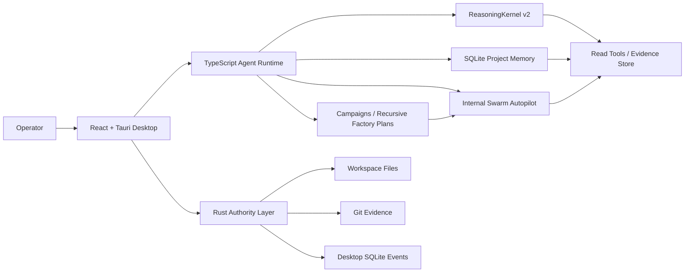
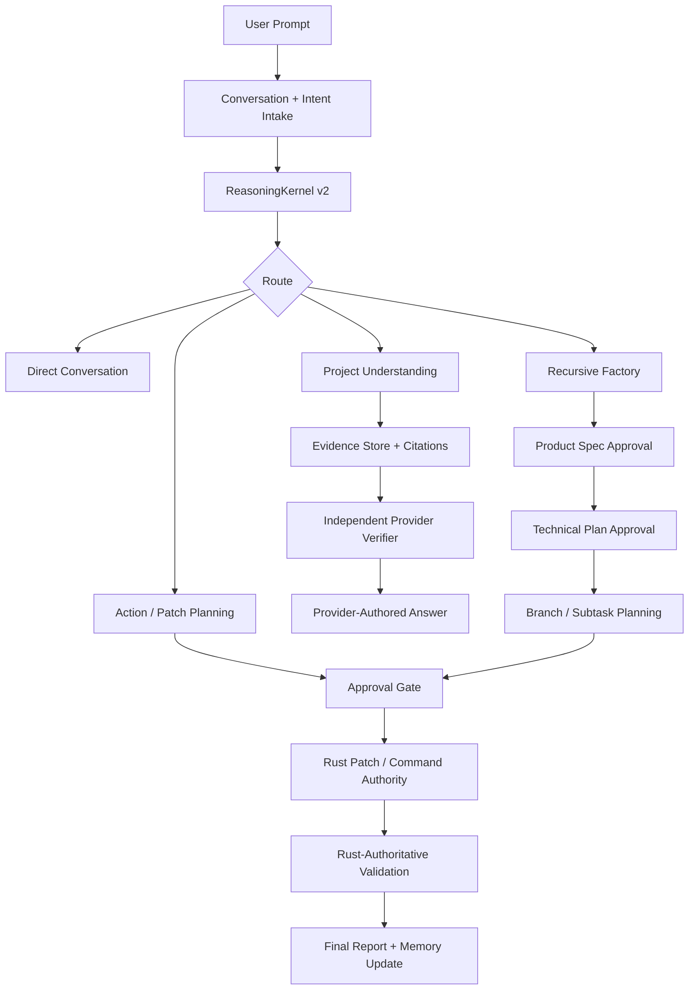
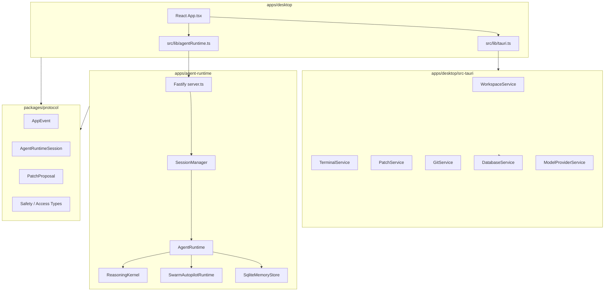
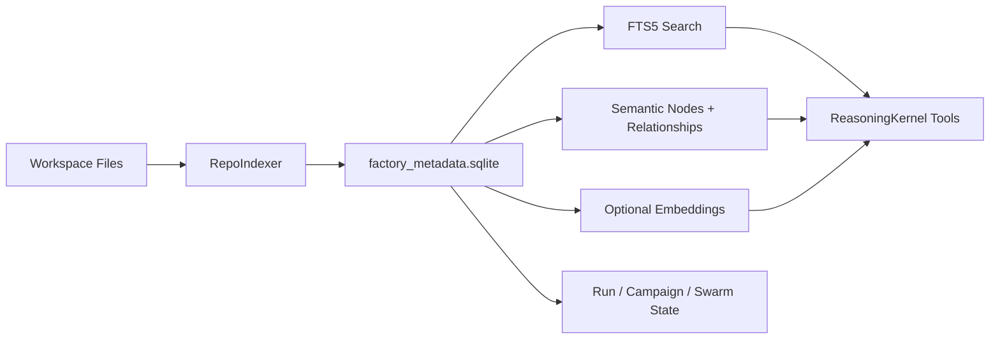
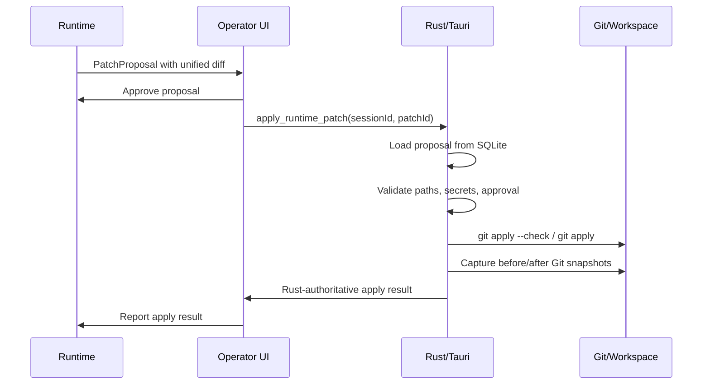
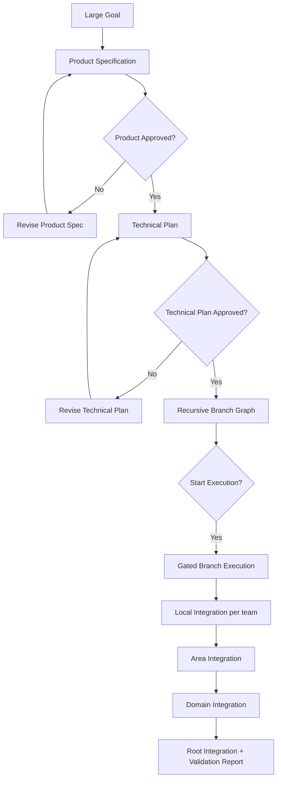

# Hivo Studio - Multi-Agent Coding System

Hivo Studio is an orchestration-first coding platform for turning narrow LLM workers into an auditable software factory. It combines a Tauri desktop operator console, a TypeScript agent runtime, SQLite-backed project memory, adaptive provider reasoning, swarm planning, approval gates, and Rust-owned patch and command authority.

The current idea is bigger than "one coding agent writes code." Hivo is moving toward a recursive coding factory: understand the repository, build durable project knowledge, route work to the right narrow specialists, require evidence before claims, stop at approvals before writes, and verify every important outcome.

## System At A Glance



## Core Idea

Hivo does not try to make one model act like a huge global brain. It builds reliability around smaller focused workers:

| Layer | What It Does |
| --- | --- |
| Repository memory | Indexes source, symbols, commands, semantic nodes, relationships, events, and durable lessons. |
| Reasoning kernel | Lets the provider choose adaptive read, tool, repair, final, ask-user, refuse, or escalate steps. |
| Project knowledge tree | Routes edit requests through whole-project, area, and leaf ownership before execution begins. |
| Swarm autopilot | Staffs internal logical agents automatically from task complexity, risk, scope, and command inventory. |
| Recursive factory | Splits large goals into approved product specs, technical plans, branch plans, and gated execution. |
| Rust authority | Owns workspace boundaries, terminal execution, patch application, Git evidence, and local persistence. |

## Updated Architecture



## Technology Stack

| Area | Stack |
| --- | --- |
| Desktop shell | Tauri 2 |
| Frontend | React 19, TypeScript, Vite, CSS, lucide-react |
| Native backend | Rust, Tauri commands, rusqlite, serde, chrono, uuid |
| Agent runtime | Node.js, TypeScript ESM, Fastify, Server-Sent Events |
| Shared contracts | `@hivo/protocol` TypeScript package |
| Memory | SQLite-first `factory_metadata.sqlite`, FTS5 search, JSON/JSONL backup artifacts |
| Agent logic | Custom orchestration, swarm, task graph, validation, review, and reasoning kernels |
| LLM providers | Ollama, OpenAI-compatible endpoints, custom/OpenRouter-compatible APIs, mock/test providers |
| Build/test | npm workspaces, TypeScript compiler, Node test runner, Cargo, Tauri CLI |

## Frameworks And Libraries

| Framework / Library | Where It Is Used |
| --- | --- |
| React | Desktop operator console UI. |
| Vite | Desktop web frontend build and dev server. |
| Tauri | Native desktop shell and JS-to-Rust command bridge. |
| Fastify | TypeScript runtime HTTP and SSE server. |
| SQLite / rusqlite | Desktop persistence and SQLite-first project memory. |
| Node.js test runner | Runtime test execution after TypeScript build. |
| Cargo test/check | Rust backend validation. |
| lucide-react | UI icons. |
| tsx | TypeScript scripts, CLIs, and dev watch mode. |

## Main Components



## Repository Layout

```text
.
├─ apps/
│  ├─ agent-runtime/        TypeScript runtime, reasoning, memory, swarm, campaigns
│  └─ desktop/              React frontend and Tauri desktop app
│     └─ src-tauri/         Rust authority layer
├─ packages/
│  └─ protocol/             Shared TypeScript contracts
├─ docs/                    Architecture, security, usage, certification docs
├─ .agent_memory/           SQLite memory, backups, runs, campaigns, evals
├─ scripts/                 Launch helpers
└─ package.json             npm workspace command surface
```

## Memory And Project Understanding

Hivo memory is now SQLite-first. `.agent_memory/factory_metadata.sqlite` is the source of truth for repository snapshots, durable knowledge, semantic project nodes, relationships, embeddings, structured run state, ordered events, FTS5 search, and orchestration metadata.



Useful commands:

```powershell
npm run memory:index
npm run memory:index-status
npm run memory:index-refresh
npm run memory:db-status
npm run memory:search -- "patch authority"
npm run memory:export-backup
```

## Safety Model

The most important rule: runtime workers can read, reason, request commands, and propose patches, but they do not directly write project files.



Command execution follows the same principle: the runtime requests a command, but Rust classifies and executes it only when policy and approval allow.

## ReasoningKernel v2

The adaptive reasoning lane is provider-authored and evidence-gated.

- The first provider call returns `TurnUnderstanding` plus the initial `ReasoningStep`.
- The provider can request tool batches, repair, final answer, ask-user, refuse, or escalate.
- Local code executes only allowed tools and stores evidence.
- Identical repeated tool batches are rejected rather than executed twice.
- Zero-gain tool rounds trigger repair and then explicit failure.
- Final answers require citation verification and an independent provider verifier.
- Operational provider failure ends the turn with `finalResponseSource: none`, not a local fallback answer.

## Recursive Factory

Large goals can enter a recursive factory lane:



The first layers are planning-only. They cannot create patches, run commands, or write files until the relevant approvals are complete. Recursive fan-in is hierarchical: root integration consumes domain summaries and verified artifacts, not raw branch diffs from every worker.

## Verification And Certification

| Gate | Purpose |
| --- | --- |
| `npm run test` | Builds and runs runtime tests. |
| `npm run test:reasoning-v2` | Runs adaptive reasoning kernel, certification, architecture, and decision-pipeline tests. |
| `npm run typecheck` | Builds protocol and typechecks all TypeScript workspaces. |
| `cargo test` | Validates Rust backend behavior inside `apps/desktop/src-tauri`. |
| `npm run smoke:patch-truth` | Runs Rust patch truth smoke coverage. |
| `npm run eval:project-understanding` | Runs multi-repository deep project-understanding evals. |
| `npm run eval:adaptive-reasoning` | Runs sealed adaptive reasoning certification gates. |

Certification is not claimed from unit tests. Adaptive reasoning certification requires exact provider/router/author/verifier/embedding profiles, sealed holdout corpora, commit-pinned repositories, semantic judging, provider provenance, and safety error checks.

## Quick Start

```powershell
npm ci
npm run memory:index-status
npm run typecheck
npm run test
```

Run the desktop app:

```powershell
npm run dev
```

Run only the web frontend:

```powershell
npm run web:dev
```

Run the agent runtime:

```powershell
npm run agent:dev
```

Run a swarm plan:

```powershell
npm run agent:plan -- "Map the runtime patch approval flow"
```

Run a swarm task:

```powershell
npm run agent:run -- "Inspect memory indexing and report risks"
```

## Operating Notes

- Check memory freshness before relying on repository context.
- Use campaigns for large goals.
- Keep executor counts small and read-only fan-out evidence-based.
- Treat approval-required status as a real stop.
- Do not bypass Rust-owned patch, command, workspace, or authority boundaries.
- Update docs when architecture, memory formats, orchestration contracts, or workflows change.

## More Documentation

- [Architecture](docs/architecture.md)
- [Orchestration Flow](docs/orchestration-flow.md)
- [Memory And Indexing](docs/architecture/memory-and-indexing.md)
- [Adaptive Reasoning Certification](docs/adaptive-reasoning-certification.md)
- [Security Model](docs/security-model.md)
- [Campaigns](docs/usage/campaigns.md)
- [Deep Dive](docs/PROJECT_DEEP_DIVE_AR.md)
