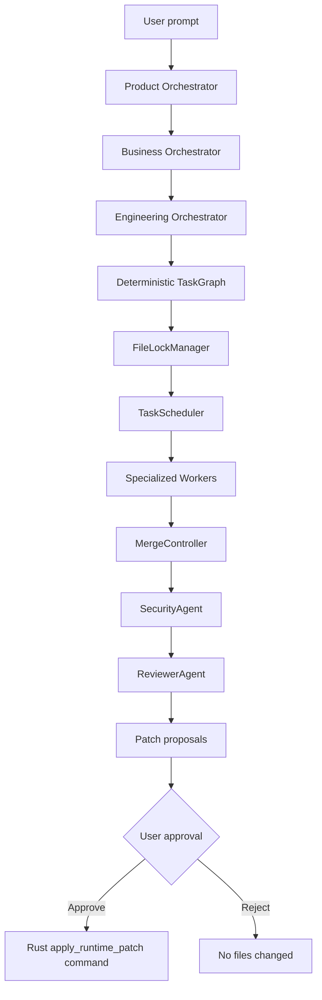

# Orchestration Flow

## Steps

1. User selects Simple Agent or Multi-Agent Orchestrated mode.
2. Runtime creates a session in mock or real LLM mode.
3. Product Orchestrator emits `ProductBrief`.
4. Business Orchestrator emits `BusinessBrief`.
5. Engineering Orchestrator creates `TechnicalPlan` and `TaskGraph`.
6. TaskScheduler runs dependency-ready tasks while FileLockManager prevents file conflicts.
7. Workers produce structured outputs, command requests, and patch proposals.
8. MergeController detects patch conflicts.
9. SecurityAgent reviews commands and patch metadata.
10. ReviewerAgent performs practical readiness review.
11. Runtime stops at approval. The desktop may then call the Rust patch command to apply the reviewed diff.
12. The frontend reports the Rust apply result back to the runtime so lifecycle state can move to post-verify or failed.

## Events

The runtime emits orchestration events such as:

- `orchestration.started`
- `product_brief.created`
- `business_brief.created`
- `technical_plan.created`
- `task.created`
- `task.started`
- `task.completed`
- `file_lock.acquired`
- `file_lock.released`
- `agent.completed`
- `patch.reviewed`
- `security.reviewed`
- `orchestration.completed`

The desktop UI displays these events in the orchestration timeline.
