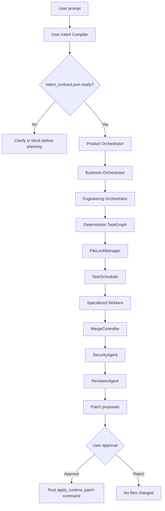

# Orchestration Flow

## Steps

1. User selects Simple Agent or Multi-Agent Orchestrated mode.
2. Runtime creates a session in real provider mode.
   Same-session chat history is passed to `ReasoningKernel` as bounded provider context only; it is not durable memory, a semantic fallback, or an answer cache.
3. `UserIntentCompiler` writes `.agent_memory/.../intent/intent_contract.json`, `.md`, and append-only revisions before any planning-capable path starts.
4. Planning is blocked when the contract is missing, invalid, provider-unavailable, or has blocking missing questions. Non-blocking questions remain recorded as assumptions or risks.
5. Product Orchestrator emits `ProductBrief` from the ready contract, using `precise_rewrite` while preserving `original_user_request`.
6. Business Orchestrator emits `BusinessBrief`.
7. Engineering Orchestrator creates `TechnicalPlan` and `TaskGraph`.
8. TaskScheduler runs dependency-ready tasks while FileLockManager prevents file conflicts.
9. Workers receive `AgentIntentInputFrame`: exact original prompt, ready intent contract, and current task slice.
10. Workers produce structured outputs with `intent_alignment`.
11. `IntentHandoffGate` blocks outputs not tied to the frame before dependencies, integration, patches, or commands can advance.
12. MergeController detects patch conflicts.
13. SecurityAgent reviews commands and patch metadata.
14. ReviewerAgent performs practical readiness review.
15. Runtime stops at approval. The desktop may then call the Rust patch command to apply the reviewed diff.
16. The frontend reports the Rust apply result back to the runtime so lifecycle state can move to post-verify or failed.

## Events

The runtime emits orchestration events such as:

- `orchestration.started`
- `intent_contract.compiled`
- `product_brief.created`
- `business_brief.created`
- `technical_plan.created`
- `task.created`
- `task.started`
- `task.completed`
- `file_lock.acquired`
- `file_lock.released`
- `agent.completed`
- `intent_handoff_gate_passed`
- `intent_handoff_gate_blocked`
- `patch.reviewed`
- `security.reviewed`
- `orchestration.completed`

The desktop UI displays these events in the orchestration timeline.
